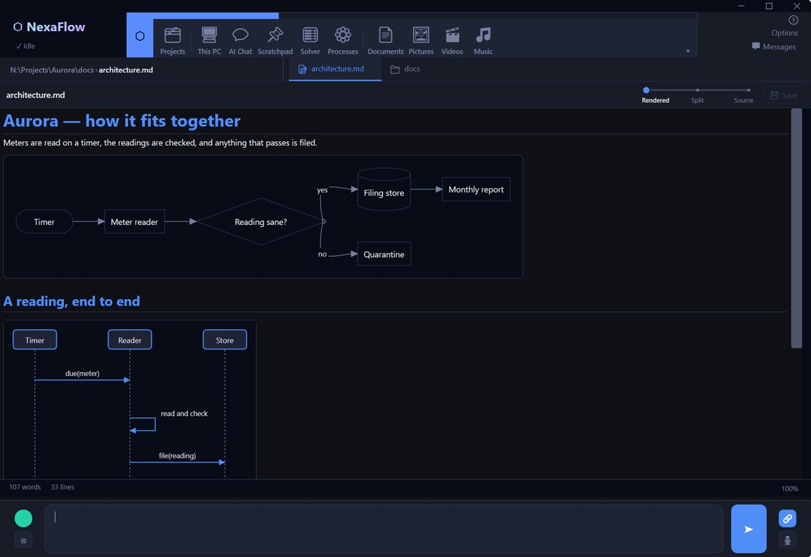
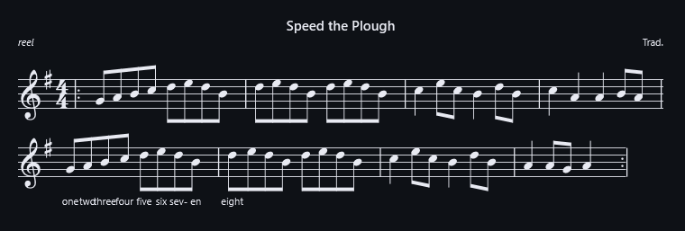

# Nexaflow

**A Windows workspace that holds your context so you don't have to.**

Nexaflow replaces the scattered pile of apps you juggle every day — file explorer, terminal, editors, viewers, trackers — with one fast, tabbed workspace where everything already knows where you are and what you're doing.

The goal isn't to add more features. It's to reduce the friction between you and the thing you're actually trying to do.


<p align="center">
  
</p>

<p align="center"><sub>A document open in the editor, its diagrams drawn as you type — no browser, no diagram server, nothing sent anywhere — and the bar at the bottom that can see it.</sub></p>

<p align="center"><b><a href="https://smile-forge.github.io/nexaflow/">See what it does →</a></b></p>

---

## The problem it solves

You know the feeling: you're in the middle of something, and you have to remember which window has the file, which terminal session is running in the right folder, which editor has the thing you were looking at twenty minutes ago. Half your cognitive overhead is just *orientation* — keeping track of where everything is so you can stay in flow.

Nexaflow treats context as a first-class citizen. Open a file and it lands in the right tool automatically. Your AI assistant can see the same tab you can. Your project folders, your tools, your search history, your workspace layout — they're all there when you come back.

Power users shouldn't have to remember everything. They should be able to *build* a context and then get on with it.

---

## What you get

**🔎 One way to search anything**

Type `?` in the input bar and you search **whatever you're looking at** — a log, a spreadsheet, a JSON file, a notebook, a registry hive, your processes, a conversation. Nearly thirty pages answer it themselves, each in the way that suits it, and `?/pattern/` is a regular expression on all of them. In a folder it uses the Windows index; when a location isn't indexed, Nexaflow offers to read the files itself and streams hits as it walks.

**📂 Files, search, and navigation**

A built-in file tree with full-text Windows Search and AI-assisted query refinement. Folder viewlets automatically recognise Git repos and .NET projects and surface that context directly to the assistant — so you don't have to explain where you are. Long copies, moves and deletes report their progress, throughput and ETA above the tree, and can be cancelled.

**📝 Editors and viewers that understand their content**

A live Markdown editor with LaTeX, native Mermaid diagrams, and QR codes, barcodes and C4 architecture diagrams generated straight from a fenced block. Formulas aren't pictures — you can put a caret in one and edit it. A code editor with syntax highlighting, code folding, colour previews, and a class/structure map. Dedicated viewers for PDFs, DICOM medical imaging, images (carousel, album, collage, explore), logs, JSON, Email (.eml/.msg), CSV/TSV tables, hex/binary, fonts, SVG, web pages, and Jupyter notebooks. This list keeps growing — understanding more formats, better, is an ongoing focus.

It isn't only diagrams. Sheet music engraved from ABC or LilyPond, QR codes, and five barcode families — all drawn from a fenced block, on your machine.

<p align="center">
  
  
</p>

**[Everything the Markdown editor draws →](https://smile-forge.github.io/nexaflow/author/)**

**🎬 Media and 3D**

An audio player with spectrum and waveform visualisation, `.lrc` lyrics, and ID3 tag editing. An interactive 3D model viewer supporting STL, OBJ, glTF/glb, FBX, and more. Native video playback. These aren't afterthoughts — they're part of making Nexaflow the one place you actually open things.

**📦 Archives, in place**

Browse `.zip`, `.7z`, `.tar`, `.rar`, `zstd`, and `lz4` archives like folders in the file tree. Open files inside them in their normal viewers. Edit and write changes back. Zip and unzip from the right-click menu.

**⌨️ Terminal and system tools**

A real PTY terminal with shell integration. A live Process Explorer. An installed-apps manager. A system-info dashboard, VirtualDisk mounting, and a registry editor. Inspect any `.exe`, `.dll` or `.sys` and see what it actually is — headers, sections, imports and exports. A Network tab discovers what's on your segments. Elevated actions go through a privilege bridge so you're never blindsided by a UAC prompt mid-flow.

**🗂️ Organisation built in**

Lightweight project tracking with a backlog workflow. A Product Manager for tracking status across a product tree. A Scratchpad corkboard for loose notes and ideas. Multiple workspaces you can switch between — each with its own context intact.

**🎨 Themes that go further than a colour swap**

Nine themes, each with its own palette and an optional animated backdrop, which can be stopped automatically while you're running on battery. Several paint an illustrated scene behind your work, and the diagrams in your document take the theme's colours too. Text size is yours to set, and every text surface has its own zoom on top of it.

**[See all nine →](https://smile-forge.github.io/nexaflow/themes/)**

**🤖 An assistant looking at the same screen you are**

Not an agent you send away to work somewhere you can't see. Every page describes its own state, so when you ask a question with the page attached, the send waits until that page says its context is ready — the answer is about the tab you're actually on, not a guess. Its tools then drive the same view-model your keyboard drives, so an edit the assistant makes to a document appears in your editor and saves through your save. There's no second copy to reconcile, because there was never a second copy.

Reading runs on its own; anything that writes asks first, and deletes go to the Recycle Bin. Some of the restraint is deliberate and permanent — git tooling is read-only, and file actions stay inside the folder you're in. A tool that can quietly do anything is a tool you have to supervise instead of use.

An AI input bar on every window, and a dedicated AI Chat tab with saved history. Pick from Claude, Gemini, OpenAI, or any local model via Ollama — or a combination. It's optional: Nexaflow is a workspace first, and every page works with no provider configured at all.

**[How the AI works →](https://smile-forge.github.io/nexaflow/together/)**

---

## Get it

**[⬇️ Download the latest release](https://github.com/smile-forge/nexaflow/releases/latest)**

Requires Windows 10 or 11. AI features are optional — use a local model via Ollama, or an API key for Claude, Gemini, or OpenAI.

Every page's help is online too — the same text F1 shows you in the app: **[the full reference](https://smile-forge.github.io/nexaflow/help/)**.

On first launch, Nexaflow opens its Options panel so you can pick an AI provider and set your projects folder. That's it — start opening tabs.

---

## For developers

Nexaflow is a .NET 10 / WPF app built on a strict, modular architecture — a thin shell that hosts independent feature and provider modules. Building from source is two commands:

```bash
git clone https://github.com/smile-forge/nexaflow.git
cd nexaflow
dotnet build Nexaflow.slnx
dotnet run --project src/Nexaflow.Core/Nexaflow.Core.csproj
```

If you're interested in how it all fits together — the shell/feature/provider layering, how to add a new tab, the theming system, and testing — start here:

- [docs/Architecture.md](docs/Architecture.md) — the big picture, ownership & lifetime, dependency rules
- [docs/features.md](docs/features.md) — how a feature is built and registered
- [docs/theming.md](docs/theming.md) — the layered theme system
- [docs/testing.md](docs/testing.md) — the test projects and how to run them

---

## What's next

The focus is straightforward: understand more of what you throw at it, give the AI better context to work with, and keep reducing friction everywhere.

Concretely:

- **More and better viewers** — more formats, richer understanding of the ones already there

- **Deeper AI context** — giving the AI more of what it needs to be genuinely useful in the tab you're in, not just adjacent to it

- **Native local model support** — ONNX / DirectML in-process inference, no external service required

---

## Contributing & community

Contributions are welcome — please open an issue before starting significant work so we can coordinate. The details:

- [CONTRIBUTING.md](CONTRIBUTING.md) — how to get set up and submit changes
- [CODE_OF_CONDUCT.md](CODE_OF_CONDUCT.md) — community standards
- [SECURITY.md](SECURITY.md) — how to report a security concern

---

## License

Nexaflow is free and unencumbered software released into the public domain under the [Unlicense](LICENSE.txt). No accounts. No telemetry. No lock-in. Use it, modify it, ship it.
