# Markdown

Nexaflow renders Markdown **natively** — no browser, no JavaScript, no round-trip to a web view.
Open a `.md` file and you get a fast, scrollable, fully-styled document: headings, tables, task
lists, callouts, real LaTeX math, and a complete family of **Mermaid diagrams** drawn directly on
the canvas.

This page is a tour of what the renderer can do, with the Markdown you'd write on the left and the
actual Nexaflow output on the right.

---

## Viewing & authoring

Markdown opens in its own tab — there's nothing to configure.

- **Open** — double-click any `.md` file in the file explorer (or open it from a project, a
  search result, or a snaplink). It lands in a Markdown tab.
- **Read & edit inline** — by default the tab shows the *rendered* document and lets you edit it in
  place: type into a heading, a list, or a paragraph and it stays formatted as you go.
- **Toggle the raw source** — flip the toolbar switch to drop to plain Markdown source when you want
  to hand-tune the exact text (front-matter, a fiddly table, a diagram fence), then flip back.
- **Save** — `Ctrl`+`S`. The tab tracks unsaved changes and the title shows when you're dirty.

Everything below works in both the rendered view and the preview — it's the same renderer.

---

## The basics

Standard CommonMark — headings, **bold**, _italic_, `inline code`, ordered and unordered lists,
links, and block quotes — all themed to match the app.

````markdown
# Release notes

**Nexaflow** renders _CommonMark_ plus a stack of extensions, drawn natively in WPF — no browser.

1. Open any `.md` file from the explorer
2. Edit inline, or toggle the raw source
3. Save with `Ctrl`+`S`

> Diagrams are first-class — drop a fenced mermaid block anywhere.
````


---

## Tables & task lists

Pipe tables support per-column alignment and inline formatting; task lists render as tidy
check glyphs.

````markdown
| Feature     | Status | Notes              |
|:------------|:------:|-------------------:|
| Pipe tables |   ✅   | alignment + inline |
| Task lists  |   ✅   | display glyphs     |
| Math        |   ✅   | LaTeX via WpfMath  |

- [x] Render tables
- [x] Render task lists
- [ ] Pour another coffee
````

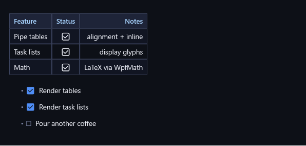

---

## Callouts

GitHub-style alert blocks (`> [!NOTE]`, `[!TIP]`, `[!IMPORTANT]`, `[!WARNING]`, `[!CAUTION]`) become
coloured, labelled callouts.

````markdown
> [!NOTE]
> Diagrams render natively — no JavaScript, no browser.

> [!TIP]
> Toggle the raw source from the toolbar to tweak the markdown.

> [!WARNING]
> Remote images aren't fetched; only local files load.
````

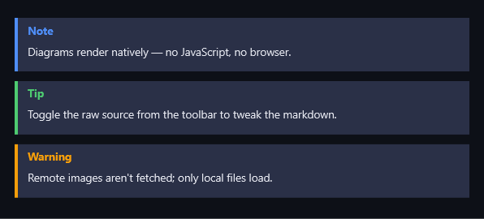

---

## Rich inline extensions

Beyond CommonMark you also get highlight (`==`), strikethrough (`~~`), subscript (`~`), superscript
(`^`), underline (`++`), definition lists, and citations.

````markdown
You can ==highlight==, ~~strike out~~, write H~2~O and E = mc^2^, and ++underline++ inline.

Leader
: A definition list term with a hanging-indent description.

Attribute it with an ""inline citation"" too.
````


---

## Math

Block (`$$…$$`) and inline (`$…$`) LaTeX are typeset with real math layout.

````markdown
The Gaussian integral, rendered as real math:

$$\int_{-\infty}^{\infty} e^{-x^2}\,dx = \sqrt{\pi}$$

Inline math like $E = mc^2$ flows with the text.
````

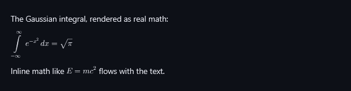

---

## Mermaid diagrams

This is where Nexaflow goes furthest. Drop a fenced `mermaid` block into any document and it's drawn
**natively** — there's no diagram server and no embedded browser. Every diagram below was produced by
the built-in renderer.

To create one, just fence your diagram with `mermaid`:

````markdown
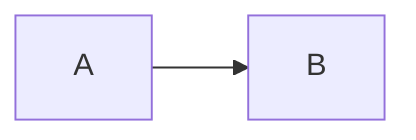
```mermaid
flowchart LR
    A --> B
```
````

The rest of this section walks through every supported diagram type.

### Flowchart

Boxes, decisions and flows in any direction, with shaped nodes and labelled edges.

````markdown
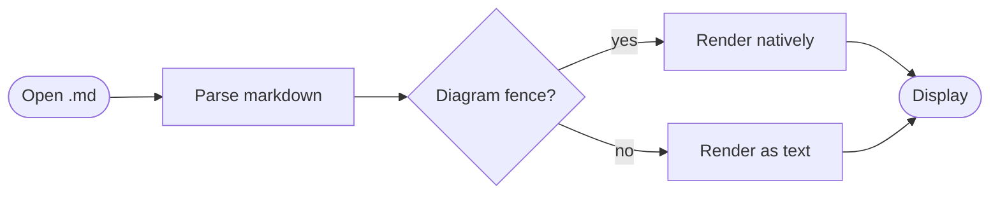
```mermaid
flowchart LR
    Start([Open .md]) --> Parse[Parse markdown]
    Parse --> Q{Diagram fence?}
    Q -- yes --> Native[Render natively]
    Q -- no --> Text[Render as text]
    Native --> Done([Display])
    Text --> Done
```
````

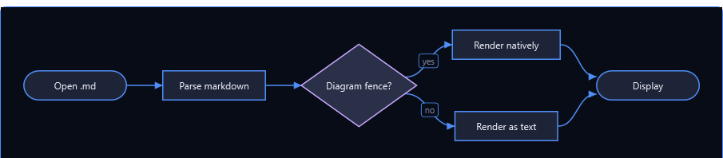

### Sequence diagram

Participants and the messages between them, including notes and async arrows.

````markdown
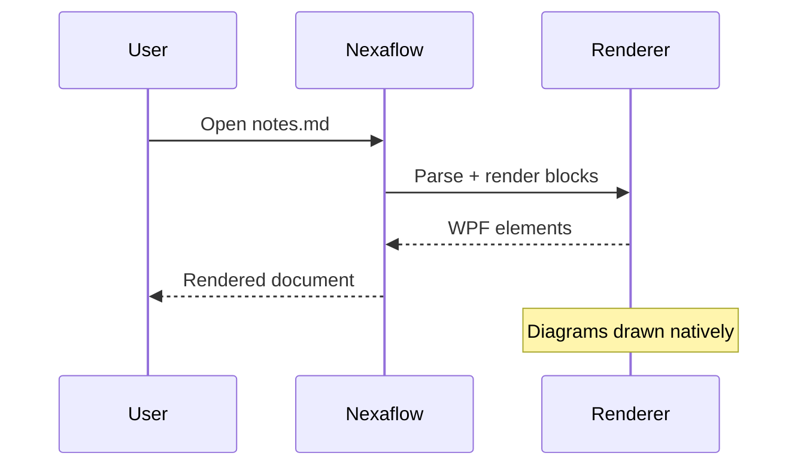
```mermaid
sequenceDiagram
    participant U as User
    participant N as Nexaflow
    participant R as Renderer
    U->>N: Open notes.md
    N->>R: Parse + render blocks
    R-->>N: WPF elements
    N-->>U: Rendered document
    Note over R: Diagrams drawn natively
```
````

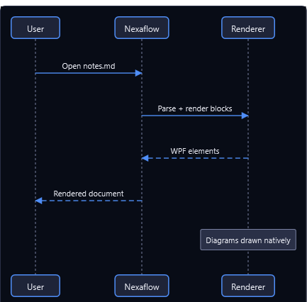

### Class diagram

UML classes with attribute and method compartments and the full relationship set.

````markdown
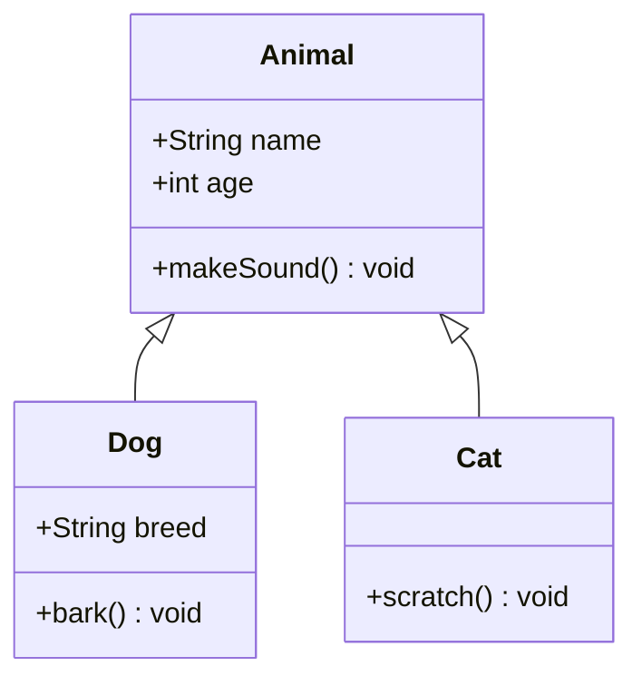
```mermaid
classDiagram
    class Animal {
        +String name
        +int age
        +makeSound() void
    }
    class Dog {
        +String breed
        +bark() void
    }
    class Cat {
        +scratch() void
    }
    Animal <|-- Dog
    Animal <|-- Cat
```
````

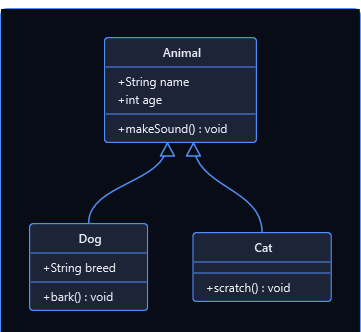

### State diagram

States, transitions, start/end markers and composite states.

````markdown
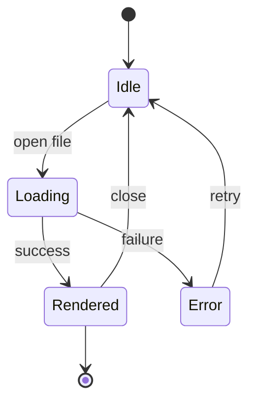
```mermaid
stateDiagram-v2
    [*] --> Idle
    Idle --> Loading : open file
    Loading --> Rendered : success
    Loading --> Error : failure
    Rendered --> Idle : close
    Error --> Idle : retry
    Rendered --> [*]
```
````

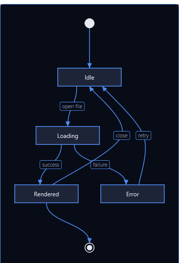

### Entity-relationship diagram

Entities with typed attributes and keys, joined by **crow's-foot** cardinality. Identifying
relationships use solid lines, non-identifying use dashed.

````markdown
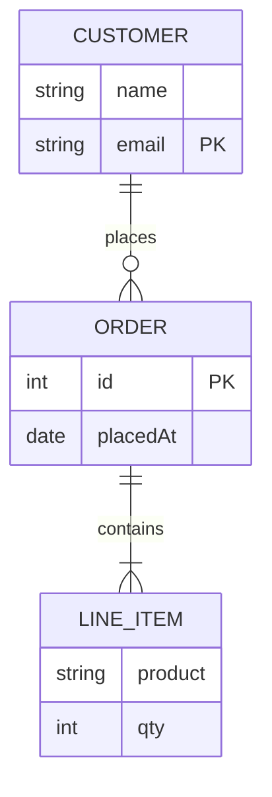
```mermaid
erDiagram
    CUSTOMER ||--o{ ORDER : places
    CUSTOMER {
        string name
        string email PK
    }
    ORDER ||--|{ LINE_ITEM : contains
    ORDER {
        int id PK
        date placedAt
    }
    LINE_ITEM {
        string product
        int qty
    }
```
````

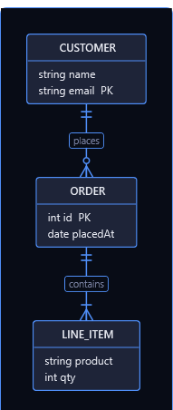

### Requirement diagram

SysML-style requirements and elements with their satisfy / verify / derive relationships.

````markdown
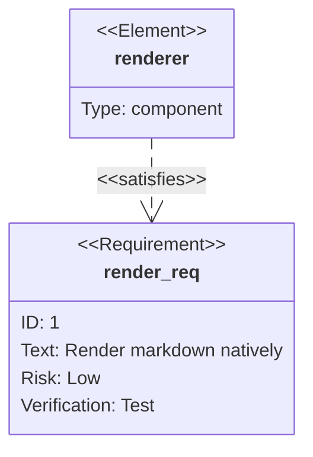
```mermaid
requirementDiagram
    requirement render_req {
        id: 1
        text: Render markdown natively
        risk: low
        verifymethod: test
    }
    element renderer {
        type: component
    }
    renderer - satisfies -> render_req
```
````

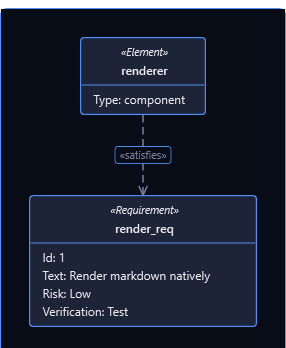

### Gantt chart

Project schedules with sections, dependencies (`after`) and task states (`done` / `active`).

````markdown
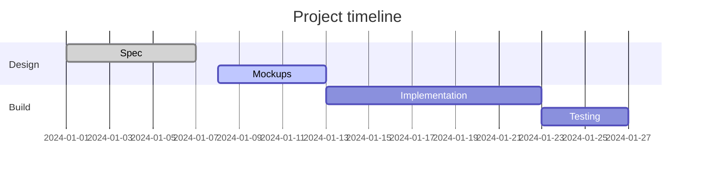
```mermaid
gantt
    title Project timeline
    dateFormat YYYY-MM-DD
    section Design
    Spec           :done,   des1, 2024-01-01, 2024-01-07
    Mockups        :active, des2, 2024-01-08, 5d
    section Build
    Implementation :        b1, after des2, 10d
    Testing        :        b2, after b1, 4d
```
````

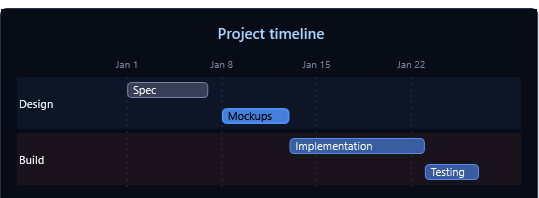

### Git graph

Commit history across branches, with merges.

````markdown
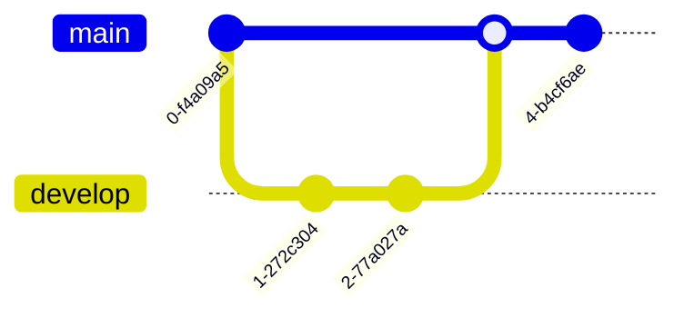
```mermaid
gitGraph
    commit
    branch develop
    commit
    commit
    checkout main
    merge develop
    commit
```
````

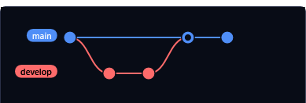

### Kanban board

Columns of cards with priority, assignee and ticket metadata — drawn as a real board.

````markdown
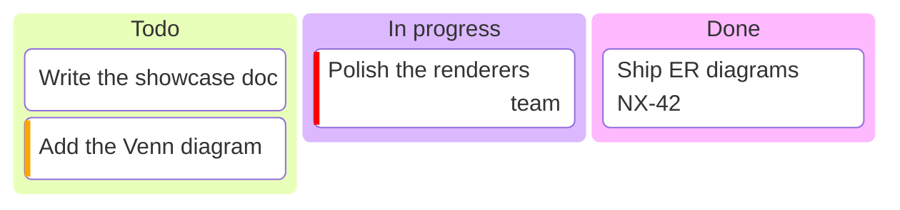
```mermaid
kanban
  Todo
    [Write the showcase doc]
    a[Add the Venn diagram]@{ priority: 'High' }
  [In progress]
    b[Polish the renderers]@{ assigned: 'team', priority: 'Very High' }
  Done
    c[Ship ER diagrams]@{ ticket: NX-42 }
```
````


### Mindmap

Free-form hierarchies branching out from a central idea.

````markdown
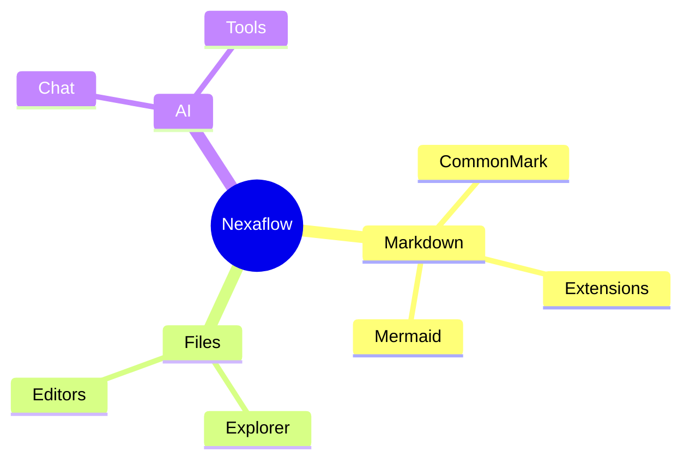
```mermaid
mindmap
  root((Nexaflow))
    Markdown
      CommonMark
      Extensions
      Mermaid
    Files
      Explorer
      Editors
    AI
      Chat
      Tools
```
````


### Pie chart

Proportional slices with a title.

````markdown
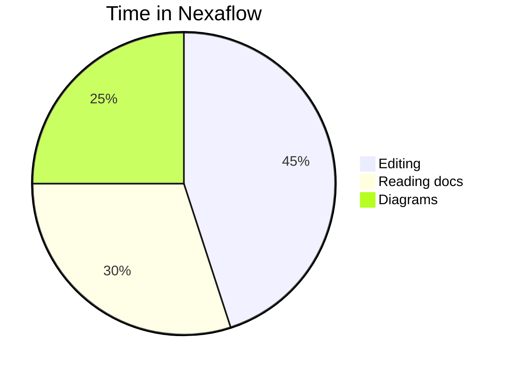
```mermaid
pie title Time in Nexaflow
    "Editing" : 45
    "Reading docs" : 30
    "Diagrams" : 25
```
````

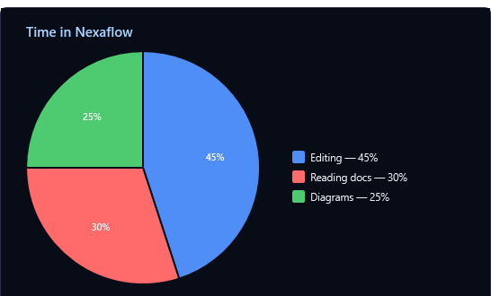

### XY chart

Bar and line series over a shared axis — combine them, name them for a legend, and weight the
colours with config.

````markdown
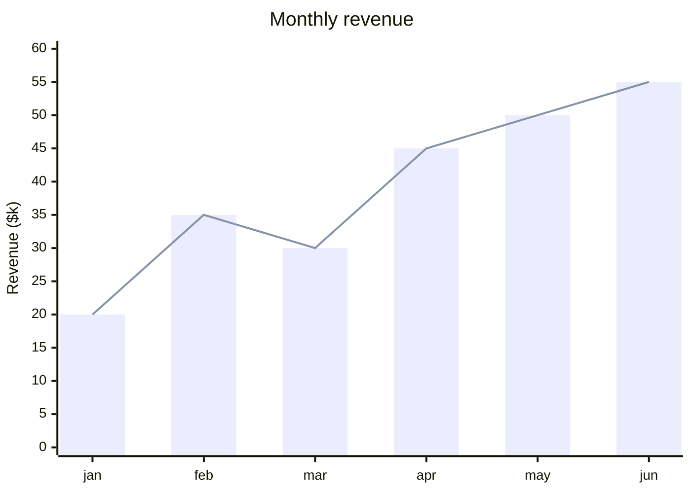
```mermaid
xychart-beta
    title "Monthly revenue"
    x-axis [jan, feb, mar, apr, may, jun]
    y-axis "Revenue ($k)" 0 --> 60
    bar [20, 35, 30, 45, 50, 55]
    line [20, 35, 30, 45, 50, 55]
```
````

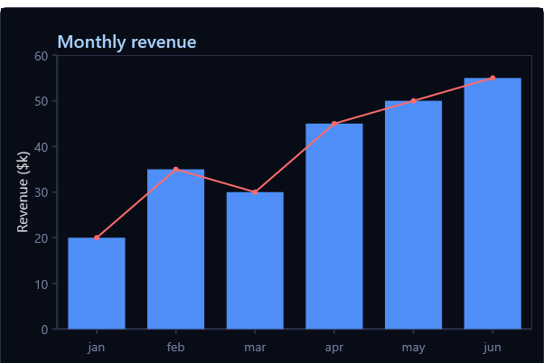

### Radar chart

Multi-axis comparison (a.k.a. spider chart), with one closed curve per series.

````markdown
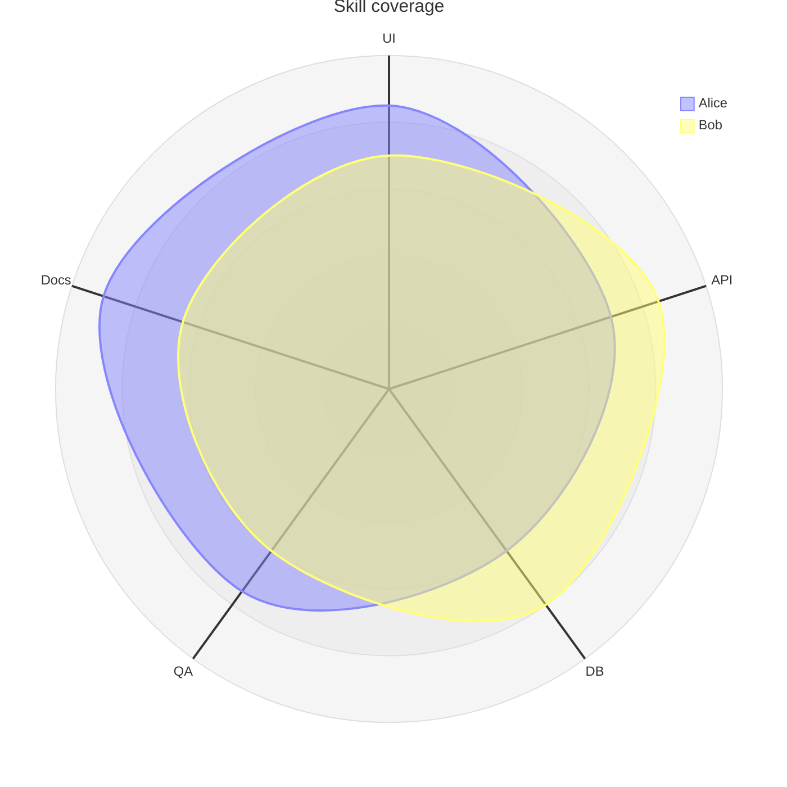
```mermaid
---
title: "Skill coverage"
---
radar-beta
  axis ui["UI"], api["API"], db["DB"], qa["QA"], docs["Docs"]
  curve alice["Alice"]{85, 70, 60, 75, 90}
  curve bob["Bob"]{70, 85, 80, 60, 65}
  max 100
```
````

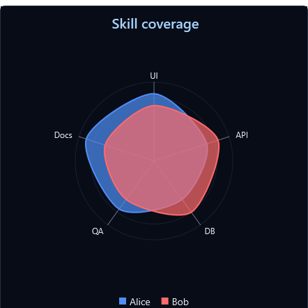

### Quadrant chart

Plot items against two axes, captioned by quadrant.

````markdown
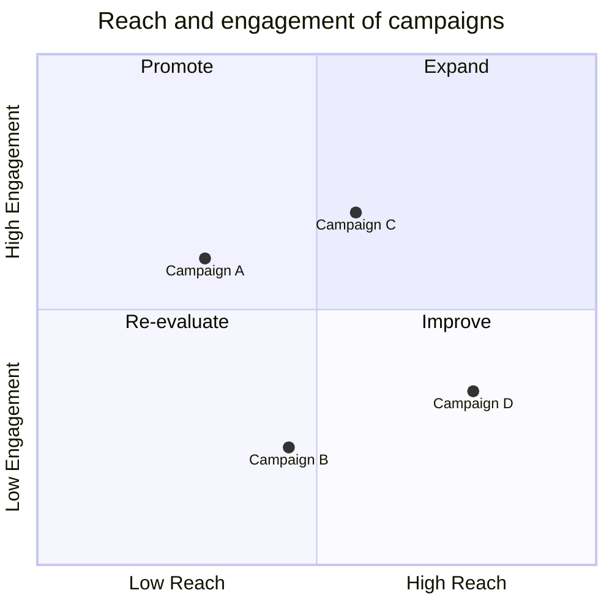
```mermaid
quadrantChart
    title Reach and engagement of campaigns
    x-axis Low Reach --> High Reach
    y-axis Low Engagement --> High Engagement
    quadrant-1 Expand
    quadrant-2 Promote
    quadrant-3 Re-evaluate
    quadrant-4 Improve
    Campaign A: [0.3, 0.6]
    Campaign B: [0.45, 0.23]
    Campaign C: [0.57, 0.69]
    Campaign D: [0.78, 0.34]
```
````

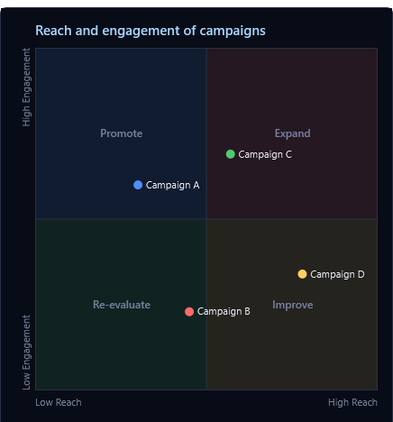

### Sankey diagram

Flows whose ribbon widths are proportional to value, with optional value labels and units.

````markdown
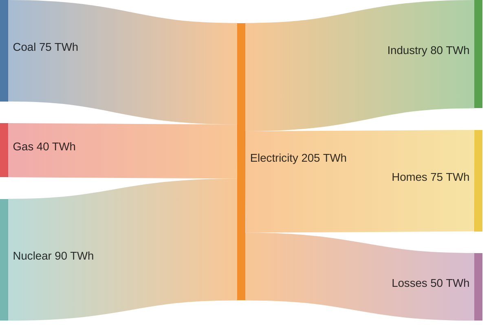
```mermaid
---
config:
  sankey:
    showValues: true
    suffix: " TWh"
---
sankey

Coal,Electricity,75
Gas,Electricity,40
Nuclear,Electricity,90
Electricity,Industry,80
Electricity,Homes,75
Electricity,Losses,50
```
````

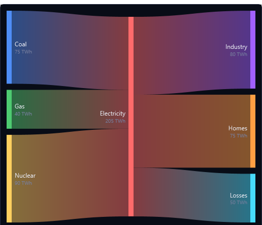

### Ishikawa (fishbone) diagram

Cause-and-effect / root-cause analysis: an effect on the spine, with categories and nested causes
branching off it.

````markdown
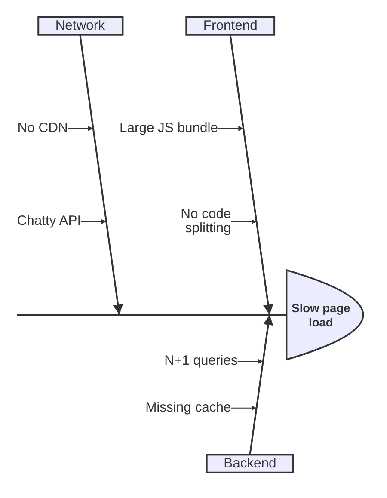
```mermaid
ishikawa-beta
    Slow page load
    Frontend
        Large JS bundle
        No code splitting
    Backend
        N+1 queries
        Missing cache
    Network
        No CDN
        Chatty API
```
````

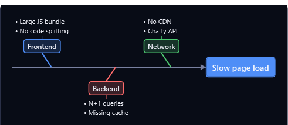

### Venn diagram

Overlapping sets, sized by weight, with labelled intersections.

````markdown
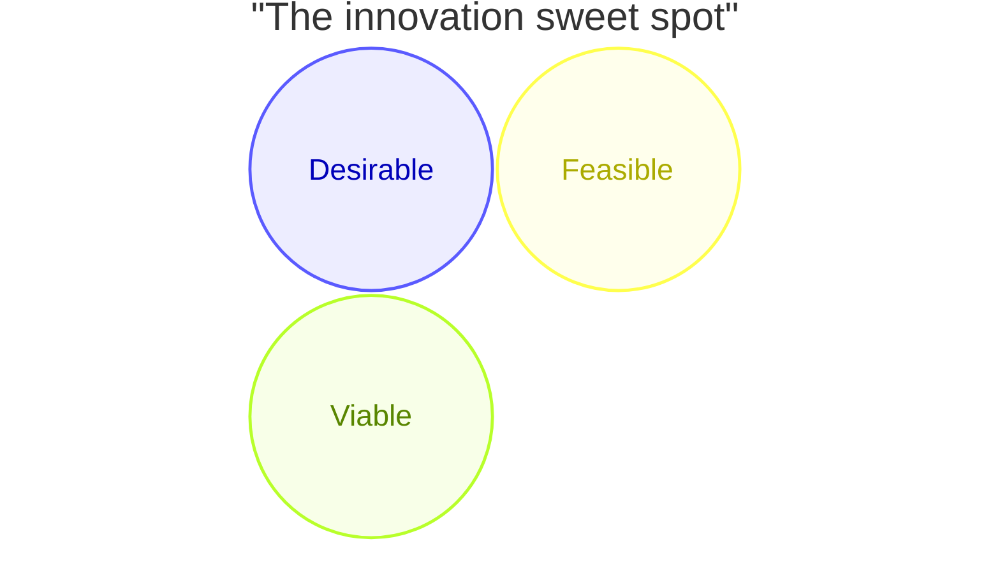
```mermaid
venn-beta
  title "The innovation sweet spot"
  set Desirable
  set Feasible
  set Viable
  union Desirable,Feasible,Viable["Innovation"]
```
````

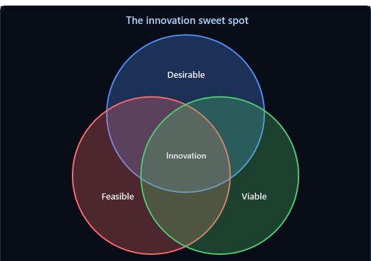

---

## QR codes

A fenced `qr` block becomes a scannable QR code, generated on your machine like everything else here.
The body is a flat list of `key: value` lines — a `type:`, then the fields that type needs:

````markdown
```qr
type: url
url: https://markdown.org
```
````


The point of the `type:` is that a QR code only carries text — a phone offers to *join this network*
or *add this contact* because the text follows a convention. Writing the convention by hand is
miserable, so the block writes it for you:

| `type:` | Fields | What a scanner offers |
|---|---|---|
| `text` | `text` | Plain text |
| `url` | `url` | Open the link (a missing `https://` is filled in) |
| `email` | `email`, `subject`, `body` | Compose a message |
| `phone` | `phone` | Dial |
| `sms` | `number`, `message` | Send a text |
| `wifi` | `ssid`, `password`, `security`, `hidden` | Join the network |
| `vcard` | `name`, `org`, `title`, `phone`, `email`, `url`, `address` | Add the contact |
| `geo` | `lat`, `lng` | Open the map pin |
| `event` | `title`, `location`, `start`, `end` | Add to the calendar |
| `crypto` | `coin`, `address`, `amount` | Open the wallet |

Any block can also carry these settings:

| Setting | Values | Default |
|---|---|---|
| `ec` | `L`, `M`, `Q`, `H` — how much damage the code survives | `M` |
| `cellSize` | pixels per module, 1–64 | `4` |
| `margin` | quiet zone in modules, 0–32 | `4` |
| `dark` | hex colour of the modules | the theme's |
| `light` | hex colour behind them | the theme's |

```qr
type: wifi
ssid: MyNetwork
password: s3cr3t-pass
security: WPA
ec: H
cellSize: 6
```

Higher error correction is worth it for anything that will be printed, put on a curved surface, or
partly covered — it costs capacity, so the same content needs a slightly larger code.

A block that can't be built says so in place of the picture, naming the line at fault: a misspelled
setting, a field belonging to another type, a missing required field, or content too long to fit.

---

## Good to know

- **It's all local.** Diagrams and math render on your machine — nothing is sent anywhere, and the
  renderer works offline.
- **Local images only.** `` loads local image files; remote `http(s)` and `data:` images are
  not fetched (you'll see the alt text instead).
- **Front-matter config.** Several diagrams accept a `--- config: … ---` front-matter block to tune
  their look (colours, sizes, orientation) — see the XY, radar, Sankey and Venn examples above.
- **What a QR code *does* is the scanner's business, not the code's.** The same Wi-Fi code joins the
  network when scanned from Android's *add a network* screen and runs a web search when scanned from
  a home-screen search widget; a contact card offers to create a contact from inside the phone's
  Contacts app and to merge into an existing one from a general-purpose scanner. If a code seems not
  to work, scan it from the app that owns the thing it describes before suspecting the code.

For the engineering-level breakdown of exactly what's supported, see
[Markdown support](../MarkdownSupport.md).
