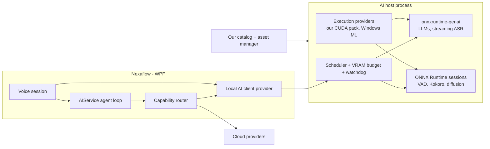
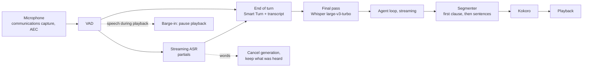

# Local AI — voice conversation, on-device models, media generation

**Status: proposal.** Nothing here is built. It records what was measured, the decisions taken, the design that
follows, and the order to build it in. Where it names a type, check for collisions before introducing it.

The test beds behind every number here live outside the repository, in `D:\codedev\nexaflow-ai-testbed` (its
`README.md` says how to re-run each measurement), until the implementation is done.

## What we want

1. **Voice conversation.** Press once to start listening; the session stays open until the user (or the
   assistant) ends it. The user speaks, the assistant answers aloud, either side can interrupt, and tools and page
   context work as they do in the input bar.
2. **A local LLM** for machines with a 24 GB GPU — for users with no subscription, who want nothing to leave the
   machine, or who want the cheap, frequent calls kept off the API bill. Weaker than a frontier model; far better
   than nothing.
3. **Generation as agent tools**: images, speech, sounds and music; video if it ever becomes practical.

All three are built on **ONNX Runtime as the one engine, and Nexaflow owns everything around it**: onnxruntime-genai
for language, multimodal and speech-recognition models, plain ONNX Runtime sessions for TTS, voice activity
detection, diffusion and audio generators; our own catalog, downloads, execution-provider provisioning, memory
policy and scheduling.

## Decisions

| Question | Decision |
|---|---|
| Local or cloud | Chosen when a workspace is set up. **Cloud**: cloud models only, and nothing local is downloaded or loaded. **Local**: the resident model — Gemma 4 E4B by default, or whichever model the user picks — serves the workspace. **Mixing** both stays possible through the per-role grid. |
| Where voice lives | **The AI input bar**, in a voice mode: the bar becomes a live line both sides speak into, and anything the assistant produces that is not speech — a diagram, a table, code — opens as an overlay on the current page, so the user keeps working while talking. **The conversation page** is the focused alternative: both sides write into the conversation. |
| Activation | **Press to start listening**; it stays live until stopped. The assistant gets a tool to end the session itself ("that's all, thanks"). |
| TTS voice | **Kokoro** — clearly better than Pocket TTS and ZipVoice in listening. |
| Languages | **English, French and German** throughout: recognition, the model, and a Kokoro voice for each — `ff_siwis` for French, the community German fine-tune's `df_kerstin` for German. Both beat Piper's voices in listening; Kerstin is the weakest of the three (below). |
| Catalog and runtime provisioning | **Ours.** Foundry Local was evaluated and not adopted: it would own the runtime version, storage, memory policy and model list that this design needs to control (below). |

## What was measured

On an RTX PRO 6000 (96 GB) and a Ryzen 9 9950X3D: onnxruntime-genai 0.17.1, ONNX Runtime 1.30, KokoroSharp 0.8.4,
sherpa-onnx 1.13.8, Foundry Local 2.1.0.

### The model

**Gemma 4 E4B** (text, image and audio in; text out) runs from C# through `Model` + `MultiModalProcessor` +
`Generator`. The [onnx-community export](https://huggingface.co/onnx-community/gemma-4-E4B-it-ONNX) needs a
header-only graph adapter (an image/audio feature merge in the embedding graph, flattened per-layer inputs);
its q4f16 build was the best configuration found.

| | Measured |
|---|---|
| Gemma 4 E4B q4f16, CUDA | 4.9 GB download, 6.6 GB VRAM loaded, ~70 tok/s, 0.1–0.3 s to first token with an image or 20 s of audio |
| Same, CPU only | ~13 tok/s, 2.7 GB RAM, 2.5–3 s to first token with an image or audio |
| Transcription by Gemma | verbatim on clean speech; **30 s audio window, silently truncated beyond it** |
| Two LLMs resident in one process | both work; generating together they **time-slice** the GPU (30 + 30 tok/s against 60 alone) |
| Two requests on one model | 46 + 33 tok/s — batching on one model gains, separate models do not |
| Unload / reload a model (warm disk) | 0.15 s / 4.3 s |
| Cancel generation mid-answer | stops 3–13 ms after the request |
| Prefill a 3,800-token conversation | 150–330 ms |
| VRAM transient on long prompts | 33–37 GB peak — logits are allocated for every prompt position (262k vocabulary). **`chunk_size` 512 brings it to 16 GB** |
| VRAM after disposing every model | ~1.8 GB stays with the process until it exits |

onnxruntime-genai defects hit along the way, each a reason to keep native inference out of the WPF process: an
access violation when the embedding model runs on CPU and the decoder on CUDA; DirectML failing on quantized
gathers; two images in one prompt failing; CUDA graph capture producing garbage on this export; a process that hung
at exit, unkillable, when it had not held an `OgaHandle` for its lifetime.

### Voice round trip

Simulated microphone, real-time paced: Silero VAD → streaming ASR (Nemotron 0.6B int4) → Gemma 4 E4B → first
clause → Kokoro TTS.

| | Speech models on GPU | Speech models on CPU |
|---|---|---|
| Resident VRAM, all four models | 9.8 GB | 6.6 GB |
| User stops talking → assistant starts talking | **1.3 s** | 1.5–1.6 s |
| of which: end-of-turn silence wait | 600 ms | 600 ms |
| ASR, real-time factor | 15–19× | 8–11× |
| TTS, real-time factor | 19–20× | 11× |
| Barge-in: user speech detected | ≤ 210 ms after they start | same |

Starting speech at the first clause instead of the first sentence took the round trip from 1.9 s to 1.3 s. The
fixed 600 ms silence threshold also **cut an interruption in half** ("Wait, stop. Just tell me a short joke
instead." arrived as "Wait, stop") — turn detection needs more than a silence timer.

TTS compared through sherpa-onnx on CPU (8 threads): Kokoro 267 ms to first audio at 10–12× real time; Pocket TTS
422 ms at 6×; ZipVoice ~1 s at 3–4×. All three read back verbatim through ASR; Kokoro sounded clearly best.

### In a real room

Monitor speakers with a webcam microphone mounted just above them, normal volume; two speakers — native English
with accented French and basic German, and native French with B2 German:

| | Measured |
|---|---|
| Echo, assistant talking for 114 s, nobody else | raw microphone: the ASR transcribed 286 of the assistant's words and the VAD fired 20 times. **Communications capture: 0 words, 0 triggers** — about 50 dB removed from the first second, in all three languages |
| What Windows applies to a communications stream | echo cancellation, noise suppression, gain control (reported through `IAudioEffectsManager`); the echo reference set to the playback endpoint through `IAcousticEchoCancellationControl` |
| Interruptions | 14 of 14 caught, **96–236 ms** after the person started (median ~110 ms, a 96 ms speech rule included); 14–43 ms from the frame to the stop; the speaker 6 dB down ~50 ms later |
| Talking over the assistant | not suppressed — recognised as well as single-talk ("White stop, can you say that more simply", "Attends, arrête, tu peux dire ça plus simplement") |
| Backchannels ("mm-hm… yeah", "mm… oui", "ja… mhm") | the VAD fires on most (a native speaker's natural ones: 6 in French, 9 in German); **the ASR returns no words for any** |
| Typing and clicking while it talks | no triggers |
| Hesitations inside a turn ("um", "euh", "ähm"), 0.26–2.4 s | a 600 ms silence timer ends the turn at the first one; **Smart Turn waited through 21 of 22** |
| Ends of turns | Smart Turn recognised 24 of 28; it missed turns longer than its 8 s window |
| Smart Turn v3.2 on its own test set, in C# | English 95.9 % (human speech), French 93.7 %, German 95.8 %; 8 ms per decision on 4 CPU threads |
| Recognition, native speakers | English: every utterance right; French: 6 of 7 exact |
| **Short utterances** | Nemotron returns **nothing** for an isolated "No.", "Nein." or "Stopp." (clean synthetic speech), and for a B2 speaker's "Nein, nicht das" and "Entschuldigung — kurze Frage". **Whisper large-v3-turbo got every one** — from C# on onnxruntime-genai, 17 ms for a one-word turn, 23 ms for 3 s, 52–59 ms for 8 s, 3.3 GB of VRAM; it is also better on accented French. Gemma 4 E4B, asked to transcribe, got the English but not reliably the German |

### Runtime provisioning

| | Measured |
|---|---|
| onnxruntime-genai CUDA package | 210 MB, **plus ~1.1 GB of NVIDIA libraries it does not carry** (cuBLAS 13, cuDNN 9) — without them the model fails to load |
| Windows ML | 82 MB, no CUDA; Windows downloaded and registered NVIDIA's TensorRT-RTX provider itself in 6.4 s. Today's Gemma exports barely use it (12 tok/s, mostly CPU fallback) — it needs models built for the provider |
| CPU only | 27 MB |
| Two CUDA stacks in one process | **break** — they load clashing cuDNN DLLs. One CUDA stack per process |
| **One process: ONNX Runtime GPU + our CUDA pack + Windows ML** | **works.** Windows ML registered TensorRT-RTX into the GPU build's runtime in 1 s; onnxruntime-genai (Gemma reading an image) and a plain session (Kokoro, 29 ms warm) ran on CUDA with every NVIDIA library loaded from the pack folder and no toolkit on PATH |
| A CUDA pack | cuBLAS 13 (484 MB) + cuDNN 9 for CUDA 13 (407 MB), plus the CUDA provider and onnxruntime-genai's CUDA layer (183 MB) — about 1.1 GB |
| TensorRT-RTX on Kokoro and Silero graphs | both rejected (an unsupported `Squeeze` kernel; an engine build failure) — **identically in a Windows-ML-only process**, so this is the provider's graph support, not the mix |

### Foundry Local — evaluated, not adopted

[Foundry Local](https://www.nuget.org/packages/Microsoft.AI.Foundry.Local) is Microsoft's on-device model runtime:
a C# SDK (MIT) over a native core that manages a model catalog, downloads, per-machine variant selection and
execution-provider provisioning, and runs onnxruntime-genai sessions. It worked: 43 MB of payload; CUDA, TensorRT-RTX
and WebGPU provisioned in 35 s (its 2 GB CUDA pack carries cuBLAS and cuDNN); 49 catalog models with a variant
chosen per machine; Qwen 3.5 9B at ~100 tok/s; our own Gemma 4 E4B registered beside the catalog, running text, image
and audio at 65–75 tok/s; live transcription finishing 26 ms after the audio; and our direct onnxruntime-genai and
ONNX Runtime sessions running on the CUDA provider it downloaded, with no CUDA toolkit installed.

It is not adopted because it would own what this design needs to control:

- **The runtime version.** Its CUDA pack is built for one onnxruntime-genai and ONNX Runtime pair
  (`ort-1.30.0-genai-0.17.1`), and a second CUDA stack cannot share the process. New architectures arrive through
  onnxruntime-genai releases, so Foundry's release cadence would gate the larger models the strongest machines can
  run.
- **The model list.** The catalog is curated for small, broadly-shipped models. Our own models can be registered,
  but only for the model types Foundry's core runs.
- **Memory and storage.** Qwen 3.5 9B held 18–20 GB of VRAM with nothing exposed to bound it; about 19 GB on disk
  held 9 GB of models and 2 GB of providers.
- **Its defects are ours to wait on**: a catalog variant (Qwen 3.5 2B) that fails to start, a failed provider
  download reported as success, a `MAX_PATH` limit on its data directory, ~4 s of provider registration at every
  start, and telemetry on unless switched off.

What it gives — provisioning, a catalog of per-provider variants, sessions with rollback — is small and buildable,
and the design below borrows its shape. Qwen models also reasoned before answering whatever the request asked
(all 300 tokens of a budget), and Qwen 3.5's tool calls came back as text rather than parsed calls — model traits,
not Foundry's.

## Architecture

### One host process on one stack

Local models run in a helper executable Nexaflow starts on demand, talks to over named pipes, and keeps in a job
object so it dies with the app — the shape `Nexaflow.PrivilegeBridge` already has. Every reason is something the
test beds hit:

- **A native crash takes its process down.** Two access violations in onnxruntime-genai during testing; in the
  host that is a restart and a retried request, in the WPF process it is the whole app.
- **VRAM only fully returns when a process exits.** The host can be recycled to reclaim what disposed models leave
  behind.
- **Native stacks cannot be mixed.** Two CUDA stacks in one process loaded clashing cuDNN; sherpa-onnx and Windows ML
  each ship their own `onnxruntime.dll`; the same class of problem the LlamaSharp provider
  ([PR #74](https://github.com/smile-forge/nexaflow/pull/74)) fought with mirrored CUDA binaries. Core's
  `Whisper.net.Runtime.Cuda` (149 MB of ggml CUDA natives in every install) leaves the app for the same reason.
- **One owner for the GPU.** Scheduling and the VRAM budget only work if one process decides.
- **A watchdog.** Neither onnxruntime-genai nor ONNX Runtime has a request timeout; a host that stops answering is
  killed and restarted.

Inside the host there is **one ONNX Runtime and one CUDA stack**, and two surfaces over it:

- **onnxruntime-genai** — `Generator` for the LLMs with `chunk_size`, `max_length`, `RewindTo` and token-boundary
  cancellation; `MultiModalProcessor` for images and audio; `StreamingProcessor` for streaming ASR.
- **plain ONNX Runtime sessions** — Silero VAD, Kokoro (KokoroSharp takes the session options) and diffusion
  pipelines, on the same execution providers.

Execution providers come from two places, into **one host build for every machine** — ONNX Runtime's GPU build,
which carries the CUDA provider:

- **Our CUDA pack** on NVIDIA: the CUDA provider, onnxruntime-genai's CUDA layer, and NVIDIA's redistributable
  cuBLAS and cuDNN. The host puts the pack's folder at the front of its `PATH` before anything loads; nothing else
  NVIDIA is needed, toolkit or not.
- **Windows ML's provider catalog** for TensorRT-RTX, OpenVINO and NPUs: `EnsureAndRegisterCertifiedAsync`
  registers them into the same runtime, and sessions reach them through `OrtEnv.GetEpDevices`. Only Windows ML's
  bootstrap DLL ships; its own `onnxruntime.dll` must not.

A provider being present does not mean a model runs on it: TensorRT-RTX rejected the Kokoro and Silero graphs as
exported. The catalog names, per model, the providers its variants were built and checked for.

Speech runs in the same host. sherpa-onnx (wake words, denoise, diarization, 80 ms-chunk ASR) would need a process
of its own because of its runtime, and is not needed for the decisions above.

Proposed layout, mirroring `Nexaflow.Elevation`: `src/Nexaflow.AI/Nexaflow.AI.Contracts` (pipe DTOs) and
`Nexaflow.AI.Host`.

### Capabilities instead of one text contract

`ILlmProvider` stays the text-generation contract and gains what Architecture.md already names as its escape
hatches — a streaming completion and an opt-in native-tools capability — plus **audio attachments** next to image
ones (`LlmAttachment.IsImage` has no audio counterpart). Beside it, in `Providers.Common`:

| Capability | Shape |
|---|---|
| speech to text | streaming: audio frames in, partial and final transcripts out; VAD events |
| text to speech | streaming: text segments in, audio chunks out; cancel; how much was spoken |
| image generation | job: prompt (+ optional source image, mask) in, image file out, progress |
| audio generation | job: prompt in, audio file out, progress (sound effects, music) |
| video generation | job; cloud only for now |

Every capability has local and cloud implementations — OpenAI and Gemini already do speech and images — so a cloud
workspace gets voice and generation without a GPU, and a local workspace gets them on the machine. A provider
declares what it offers: input and output kinds, streaming, tools, context window, **on-device or cloud**, and a
cost class.

### Scheduling and the VRAM budget

The host owns:

- **A resident set** — the model a local workspace uses plus the speech models, loaded at warm-up and kept (4–6 s
  to reload is too slow between turns).
- **One generation slot** — image, music or a second LLM, loaded on demand and disposed afterwards. Generation
  takes seconds anyway, so a load is acceptable there.
- **Admission against a budget**: size each model from its manifest, refuse or evict rather than over-commit, and
  keep headroom for transients. Generators always run with `chunk_size` set, an explicit `max_length`, and
  `arena_extend_strategy` = 1 (grow only by what is requested).
- **Priorities, preempted at token boundaries**: live voice, then interactive chat, then background analysis, then
  generation jobs. Concurrent models time-slice the GPU, so a background analysis running during a voice reply
  halves the reply's speed unless something yields.

**Cancellation is per step.** A decode step is one token (~14 ms at 70 tok/s); the long steps are an image or audio
encode (~100 ms) and a prefill chunk (bounded by `chunk_size`). Barge-in does not wait on any of them: playback stops
at once, and cancellation only frees the GPU.

## Routing

The workspace's choice comes first: a cloud workspace never starts the host. Within a workspace, the ability grid
maps roles to models, and changes in three ways:

| Today | Proposed |
|---|---|
| Seven rows, all text; `ImageGeneration` and `AudioRecognition` are read by nothing | **Reasoning roles** (Disambiguation, Conversation, ProblemSolving, Analysis, ImageRecognition) and **media capabilities** (speech in, speech out, image, audio, video) |
| A cell is one provider + model | A cell is an **ordered chain** when a workspace mixes local and cloud: local Gemma, then Claude |
| Resources invisible | The resident set and its VRAM shown; assignments that cannot coexist on the card are refused at configuration time |

In a mixed workspace the frequent, cheap roles — Disambiguation, tool ranking, Analysis, ImageRecognition — default
to local, which is where API cost actually goes. A chain advances on unavailability (model not downloaded, host down,
budget refused), not on "try local, retry cloud" for every request — a failed local attempt costs its whole latency
first. A request whose context reports a high `GetContextSecurityRisk` is held to on-device entries.

Prompt-convention tools are an advantage here: with the chat template coming from the model itself
(`Tokenizer.ApplyChatTemplate`), a new local model needs no per-family harness — the part PR #74 had to write by
hand for Gemma and Qwen — and Qwen's unparsed tool calls do not matter.

## Voice conversation

### The pipeline

A cascade. End-to-end speech models are not a fit yet: LFM2.5-Audio speaks but is a 1.5B model weak at tools;
Moshi and Qwen-Omni have no ONNX Runtime path.

- **ASR in two passes.** Nemotron streams partials through onnxruntime-genai's `StreamingProcessor` — what the input
  bar shows as the user speaks, and the words that confirm a barge-in. When the turn ends, **Whisper large-v3-turbo**
  transcribes the whole utterance once, and that text goes to the agent. Nemotron alone loses short utterances — an
  isolated "No", "Nein", "Stopp" — which a conversation that asks for confirmation cannot lose; Whisper got every one
  measured. It is a model type onnxruntime-genai runs natively (exported with its builder, which needs a three-line fix
  for turbo's 4-layer decoder), shares the process with Nemotron (5.4 GB for both), and costs ~11 ms of encoder plus
  ~1 ms per token — 17–59 ms per turn, run while the turn detector decides. Two settings are required: the session's
  language forced in the prompt (`<|startoftranscript|><|de|><|transcribe|><|notimestamps|>` — left to detect, it heard
  "Nein." as "9."), and the CUDA option `sdpa_kernel=1` with one warm-up call at load (otherwise each new output length
  costs ~150 ms the first time).
- **TTS**: Kokoro through KokoroSharp, whose G2P is MisakiSharp — no espeak-ng.
- **Turn detection** is its own stage: [Smart Turn v3](https://huggingface.co/pipecat-ai/smart-turn-v3) (BSD-2,
  8 MB, Whisper-tiny encoder judging the audio of the last 8 s) in C#, on the communications capture, asked after
  200 ms of silence and again every ~300 ms while it answers "not finished", up to a ceiling longer than real thinking
  pauses (2.4 s was measured). The transcript is the second signal — a turn longer than 8 s, a filler at the end, a
  clause still missing its verb ("…die ich gestern"), which the audio alone judged finished. After a barge-in, a
  fragment judged complete ("Wait, stop —") is held ~1 s for the rest of the sentence.
- **The agent loop is the same one**: a voice turn goes through `RunAgentAsync` with page context and tools, in a
  "spoken reply" style. This needs streaming through the harness — today `LlmStreamRunner` accumulates the whole
  reply before anything returns.
- **Segmenter**: the first segment ends at a clause boundary, later ones at sentences.
- **Barge-in**: VAD onset (96 ms of speech) during playback **pauses** playback at once; the ASR decides. Words →
  generation is cancelled and the history keeps **only what was heard** — the measured run recorded "Garbage
  collectors track which —", not the unspoken rest of the answer. No words within ~500 ms — a backchannel, a cough —
  → playback resumes where it paused. A VAD-only rule would stop the assistant at every "mm-hm".
- **Echo cancellation**: Windows communications capture, with the playback endpoint set as its echo reference
  (`IAcousticEchoCancellationControl`) and the stream's effects checked through `IAudioEffectsManager`. WebRTC APM is
  the fallback for a device that reports no echo cancellation. Without it the assistant interrupts itself.
- **Tool approvals by voice** need a spoken confirm/deny path through `IAIResponseHandler`.
- **Ending the session**: the user's stop button, or a client tool the assistant calls when the conversation is
  over.
- The voice session is one implementation of a contract; a cloud realtime API (OpenAI Realtime, Gemini Live) can be
  another, for cloud workspaces.

Target: under a second from the user stopping to the assistant speaking, local. Measured 1.3 s with a 600 ms silence
wait; replacing that wait with Smart Turn at 200 ms of silence (~10 ms to decide, with Whisper's final pass started
at the same moment) puts a complete turn at about 0.9 s.

### In the shell

- **Input bar, voice mode.** Pressing the microphone turns the AI input bar into a live line: the user's words stream
  in as they are recognised, the assistant's spoken reply streams beside them, and the page underneath stays usable.
- **Anything that is not speech goes to an overlay.** When a reply carries markdown that speech cannot carry — a
  Mermaid diagram, a table, a code block — the segmenter speaks a short reference to it ("here's the diagram") and
  the content opens as an overlay over the current page, rendered by the shared markdown surface. The overlay is
  dismissable and does not take focus from the page.
- **The conversation page** is the focused form: speech and text both land in the conversation as messages, and rich
  content renders inline there instead of as an overlay.

`VoiceManager` (a static singleton re-transcribing the whole buffer every second with Whisper.net) and
`WhisperModelManager` are replaced by the speech capability; push-to-talk dictation becomes the same streaming ASR
without the reply.

## Languages: English, French, German

Every stage was measured on all three, with real French and German speech from FLEURS:

| Stage | English | French | German |
|---|---|---|---|
| Voice activity (Silero) | language-independent | | |
| Turn detection (Smart Turn v3.2) | 95.9 % on its test set | 93.7 % | 95.8 % |
| Streaming ASR (Nemotron 3.5) | 1.9% WER | 10.1% WER | 18.5% WER — mostly numbers written as words ("zehntausend" for "10.000") |
| Final pass (Whisper large-v3-turbo) | short answers Nemotron lost ("No.") | 1.6% WER; better on accented speech | 5.5% WER; short answers Nemotron lost ("Nein.", "Stopp.", "Nein, nicht das") |
| LLM (Gemma 4 E4B) | ✓ | fluent answers in French; accurate summaries of spoken French | fluent answers in German; accurate summaries of spoken German; answers about images in German |
| TTS | Kokoro (`af_heart` and others), MisakiSharp G2P | **Kokoro `ff_siwis`**: 307 ms to first audio, 12× real time, 5% WER read back | **Kokoro German fine-tune** (`crane-local-ai/Kokoro-82M-v1.0-German-ONNX`, voice `df_kerstin`): 9–10× real time, 0–11% WER read back |

- **Both recognisers take the session's language.** Nemotron's encoder takes a one-hot `lang_id`
  (`Generator.SetRuntimeOption("lang_id", …)`): en-US 0, fr-FR 8, de-DE 9, `auto` 101 — from NVIDIA's
  `processor_config.json`; the ONNX export carries no table. `auto` matched the fixed prompt for English and French
  and was close for German. The model tags sentences with `<xx-XX>` for English and German but not French, so the
  tags are stripped and do not decide the language. Whisper takes the language token in its prompt, and must be
  given it: detecting it alone misreads short German words.
- **The reply's language picks the voice.** Gemma answers in the language it was spoken to; the segmenter detects
  the language of each segment's text and hands it to that language's Kokoro voice.
- **German has one Kokoro voice, from one community fine-tune**, and it is the weakest of the three. A better German
  voice means fine-tuning Kokoro ourselves with the same recipe (kikiri-tts, Apache-2.0). Piper's voices were
  measured and rejected on listening.

### Phonemes for French and German

Kokoro reads phonemes, not text, and the text it speaks is the model's reply — so text-to-phoneme conversion (G2P)
runs on the user's machine, for every reply. MisakiSharp covers English only. espeak-ng covers French and German
and is the convention both voices were trained on (the German fine-tune's authors say so), but it is GPL, and run
as a process per phrase it cost 65–300 ms on the voice path.

So espeak-ng is a **build-time tool, not a shipped one**:

- **Lexicons, generated in CI.** espeak-ng runs over merged frequency lists (hermitdave/OpenSubtitles, Leipzig news
  and Wikipedia) with `--tie`, and its output goes through misaki's post-processing — the form both voices were
  trained on: language-switch flags removed, affricates and diphthongs as single tokens (`t^s`→`ʦ`, `a^ɪ`→`I`), and
  for German kikiri's `ʏ`→`y`. Plain `--ipa` output is wrong input for these voices: `ʏ` is not in Kokoro's
  vocabulary ("fünf" loses its vowel), and untied pairs arrive as two tokens. About 200k keys for French and
  200k–400k for German: 1.6–3.8 MB compressed, under a minute to build. Keys whose case changes the pronunciation
  (German `Weg`/`weg`) stay separate, so lookup is case-sensitive.
- **A C# phonemiser at runtime**, in this order: normalisation, lookup, context rules, fallback. Lookup costs
  ~0.15 µs a word; espeak as a process costs ~54 ms a phrase.
- **Normalisation is the larger job** — 6.6–6.9% of the words in measured replies never reach the lexicon: numbers
  with their contextual forms (un/une, ein/eins/einen, ordinals), times (15h30, 14:30 Uhr), dates, versions, IP
  addresses, units (Go → gigaoctets), a spell-or-read list for acronyms (USB, JSON, IA), abbreviations (z. B., etc.),
  slash pairs, and dropping emoji, LaTeX, markdown and code. espeak itself gets much of this wrong in context.
- **Context rules.** Looked up word by word, German loses nothing; French loses liaison (5% of words, more than half
  of sentences), number voicing (six, dix) and a few homographs. Both lose phrase stress on function words, which a
  closed list of ~50 words restores.
- **The fallback** runs rarely in spoken replies — with 200k keys, in 12% of French and 39% of German replies, under
  one word each — and in most assistant-style replies, where what it meets is mostly English: product names, camelCase
  brands, tech terms. So it is, in order: a product lexicon (Nexaflow, app names), camelCase splitting, an English
  path (an English lexicon mapped to Kokoro's symbols), a guarded German compound splitter (better than espeak's own
  guess in about 60% of disagreements, but it must not split suffixes or English words), and only then letter-to-sound
  rules. A port of [Crane](https://github.com/lucasjinreal/Crane)'s German G2P (MIT) covers the last step for German.

## Generation tools

Each is an `IClientTool` the agent calls (`generate_image`, `speak`, `generate_sound`, …) that runs a generation
capability as a job, reports through `IBackgroundActivityManager`, and returns a file plus a `ContextImage` where
there is one — the existing loop, approvals and context handling apply unchanged.

| | Local path | Fit |
|---|---|---|
| Speech | Kokoro | ready |
| Images | SDXL-Turbo (official ONNX) first, FLUX.1-schnell or FLUX.2 klein later; a C# diffusion pipeline (TensorStack has one, Apache-2.0) | ready to build; one generation slot |
| Music | ACE-Step 1.5 (community ONNX), custom pipeline | possible, medium effort |
| Sound effects | no maintained ONNX model; Stable Audio Open would need exporting | gap |
| Video | Wan2.1-1.3B only, minutes per clip | cloud providers only |

## Models

**No conversion on the user's machine.** onnxruntime-genai's builder cannot read quantized GGUF files (it needs the
original fp16 weights), and every converter — the builder, Olive, mobius — needs an embedded Python with torch
(1–2 GB) and tens of GB of RAM for an 8B model. New architectures reach the builder six to eight weeks after release.

**Our catalog** is a manifest of packages, each naming its source (Hugging Face — `onnxruntime/`, `microsoft/`,
`amd/`, `onnx-community/` with an adapter — or built in CI with the model builder), a variant per execution provider,
size, VRAM footprint, hash, and any adapter to apply after download. A user can also point at a folder holding a
`genai_config.json`. Because we pin onnxruntime-genai ourselves, the catalog can carry a new architecture as soon as
the release that supports it ships.

Candidates for a 24 GB card:

| Role | Model | VRAM | Notes |
|---|---|---|---|
| resident, default | Gemma 4 E4B q4f16 | ~7–11 GB with KV and transients | verified; sees and hears |
| resident, user's pick | Qwen 3.8 27B, Gemma 4 26B-A4B | 19–21 GB loaded, 21–23 GB with a 4k prompt | verified (below); neither fits beside the voice stack on 24 GB as published |
| resident, user's pick | gpt-oss-20b, Qwen 3.5 9B | ~10–20 GB | not measured here |

**The larger models, measured** (RTX PRO 6000, onnxruntime-genai 0.17.1 CUDA, uncontended):

| | Qwen 3.8 27B | Gemma 4 26B-A4B |
|---|---|---|
| Source | AMD's int4 export, unchanged but for the provider | the kibitz-coach text decoder with its MoE experts re-packed, AMD's embedding and vision |
| Download / loaded / with a 4k prompt | 16.9 GB / 19.3 GB / 21.3 GB | 19.2 GB / 21.3 GB / 23.3 GB |
| Decode / prefill 4k | 46 tok/s / 1.3–1.9 s | 80–100 tok/s / 0.29 s |
| Tool calls (7 requests, English, French, German) | 7 of 7 | 7 of 7 |
| Thinking | `enable_thinking=false` stops it (prefixed as a template variable; `/no_think` is ignored) | off by default; on, it fixed a task it otherwise got wrong |
| French and German | fluent | fluent |
| Images | read a table and caught its wrong total | none in this form — the text decoder attends causally inside an image |

- **Qwen 3.8 27B is the strongest** and runs from a published export; it is the only Qwen 3.8 size under 360 GB.
- **Gemma 4 26B-A4B is twice as fast**, but every published export is wrong on CUDA until its experts are re-packed
  (ORT's CUDA `QMoE` reads unpacked weights as packed), AMD's export degrades the model (router softmaxed twice, SiLU
  for GELU, int4 router) and its KV cache grows without bound, and the working assembly has no vision. It needs an
  export of our own: a vision-aware decoder, unquantized router, prepacked experts, sliding-window KV.
- **On 24 GB, the voice stack and either model do not fit together** (a ~20 GB budget for the model). The reductions
  that would get there — a quantized embedding table (Qwen's is 2.5 GB at fp16), a text-only build, sliding-window KV
  for Gemma — are untested. Until then this tier means 32 GB with voice, or 24 GB without it.
- GenAI 0.17.1's Minja chat-template engine needed Gemma's template patched for tools (`['function']` and `upper`);
  the catalog's adapter step covers that.
| speech | Nemotron streaming + Whisper large-v3-turbo + Kokoro + Silero + Smart Turn | ~6–7 GB (the two recognisers 5.4 GB together); Silero and Smart Turn on CPU | verified |

## Delivery

**In the app, not the installer.** Updatum re-runs the whole installer bundle (~225 MB) on every update, Burn caches
every payload a second time under Package Cache, the standard bootstrapper cannot probe a GPU, and models are a
per-machine choice users change later. At most, the bundle's Install page gains an opt-in checkbox — like
`InstallTools` — that the app reads on first run.

- **The host** ships in the base install or downloads with the first local workspace; without the CUDA pack it is
  about 30 MB (ONNX Runtime, onnxruntime-genai, Windows ML's bootstrap).
- **Execution providers**: our CUDA pack (~1.1 GB) for NVIDIA, hosted on our GitHub releases and versioned with the
  host; Windows ML's providers for other vendors and NPUs, downloaded by Windows itself.
- **Models and voices**: one hashed, resumable asset manager, generalised from `WhisperModelManager`, under
  `%LOCALAPPDATA%\Smile\nexaflow\ai\` — a short, real, non-roaming path (not `%APPDATA%`, where voice models sit
  today).
- **Hardware probe**: `HostCapabilityService` widens beyond `nvidia-smi` — VRAM and vendor for AMD and Intel, NPU
  presence — and its unused `RecommendedBackend` gains a consumer: whether to offer Local at all, and which provider.
- **Whisper's CUDA natives** leave the base install, cutting the installer and every update by about 60%.

## Build order

| Phase | Delivers | Size |
|---|---|---|
| 0. Spikes | done, measured above: echo cancellation and barge-in in a real room; Smart Turn for English, French and German; lexicon coverage on real replies; Qwen 3.8 27B and Gemma 4 26B-A4B. Whisper large-v3-turbo from C#. Open: a 24 GB build of the larger models | small, each |
| 1. Contracts and plumbing | capability contracts, streaming through the harness, audio attachments; workspace local/cloud choice and grid chains; asset manager and catalog manifest; wider hardware probe | medium |
| 2. AI host + local LLM | the host, its pipe protocol, scheduler, budget and watchdog; provider provisioning; the client provider — superseding PR #74 | large |
| 3. Voice | speech in the host; voice session with turn detection and barge-in; the French and German phonemiser and lexicons; the input-bar voice mode and overlay; replaces `VoiceManager` | large |
| 4. Generation tools | speech and image tools first; music after; video through cloud providers | medium per tool |

Phase 1 is useful on its own — streaming improves the cloud path before any local model exists.

## Risks

- **We own the runtime.** Upgrading onnxruntime-genai and ONNX Runtime, assembling the CUDA pack, and tracking
  NVIDIA's library versions are ours to do — the price of choosing when.
- onnxruntime-genai's Engine (paged KV, prefix caching, continuous batching) is in its C API only; C# would need our
  own P/Invoke layer. The `Generator` API works without it.
- onnxruntime-genai defects above; exports per execution provider; architecture support lagging releases.
- Every diffusion and music model needs a hand-written C# pipeline (scheduler, tokenizer, sampler).
- Licences do not block a non-commercial project. espeak-ng (GPL) runs only in our build; whether its generated
  pronunciations may ship as data is worth confirming — Wiktionary's IPA (CC BY-SA, as Crane uses for German) is the
  alternative source. The hermitdave word list is CC BY-SA and Leipzig's CC BY: the lexicon files carry attribution.
- German speech rests on one community Kokoro fine-tune with one voice, the weakest of the three.
- **Recognition rests on two models.** Nemotron for partials, Whisper large-v3-turbo for the final text; native
  German speech is measured only as read speech (FLEURS) and through a B2 speaker.
