# Markdown — Diagrams: charts & analysis

Diagrams for proportion, distribution, comparison and cause: pie, XY, radar and quadrant charts, Sankey, Ishikawa, Venn and Cynefin diagrams.

---

## Pie chart

Proportional slices with a title.

````markdown
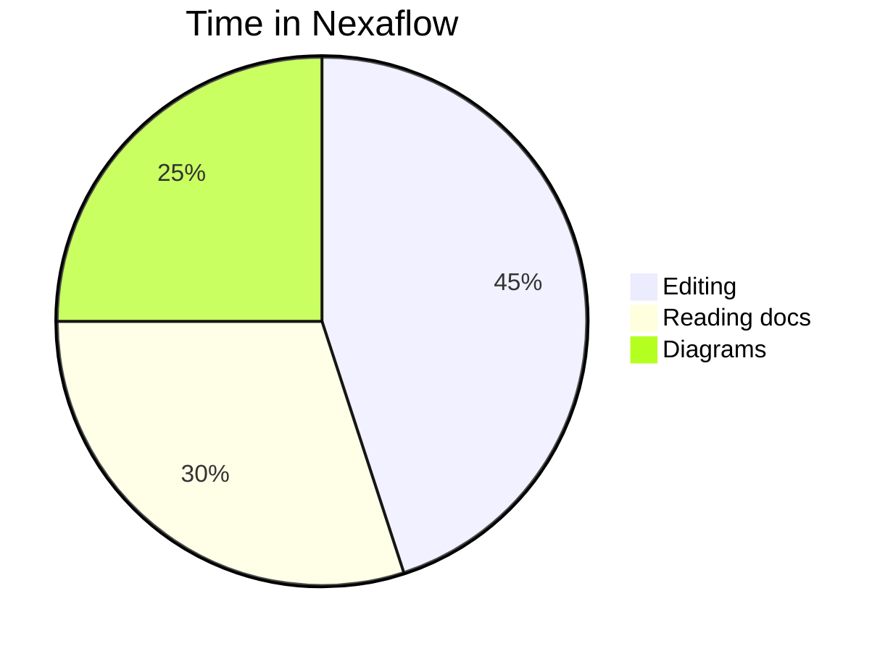
````

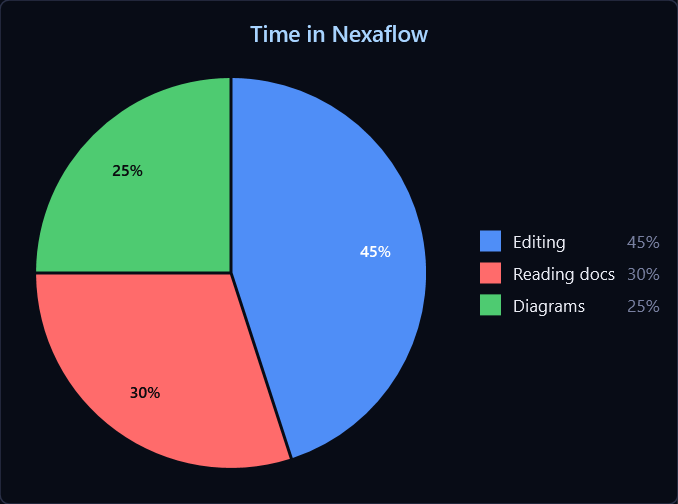

---

## XY chart

Bar and line series over a shared axis — combine them, name them for a legend, and weight the
colours with config.

````markdown
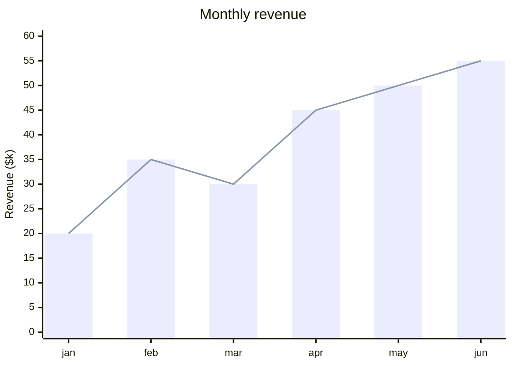
````

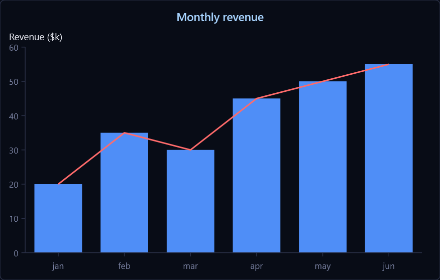

---

## Radar chart

Multi-axis comparison (a.k.a. spider chart), with one closed curve per series.

````markdown
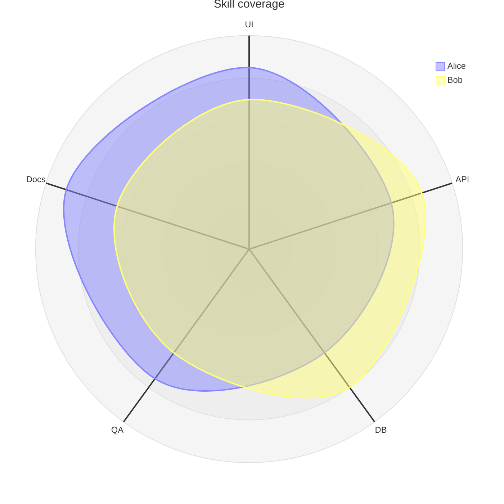
````

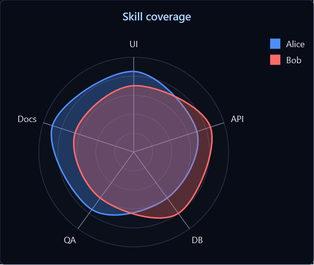

---

## Quadrant chart

Plot items against two axes, captioned by quadrant.

````markdown
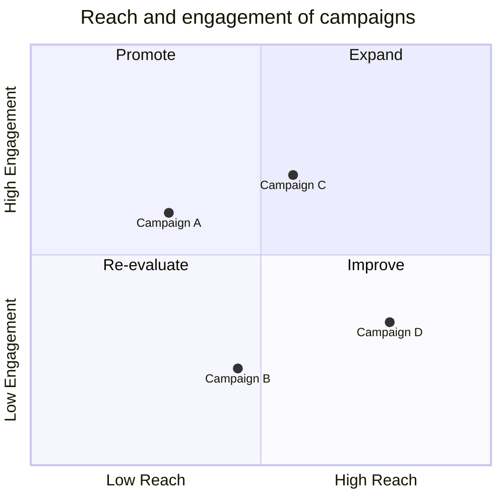
````

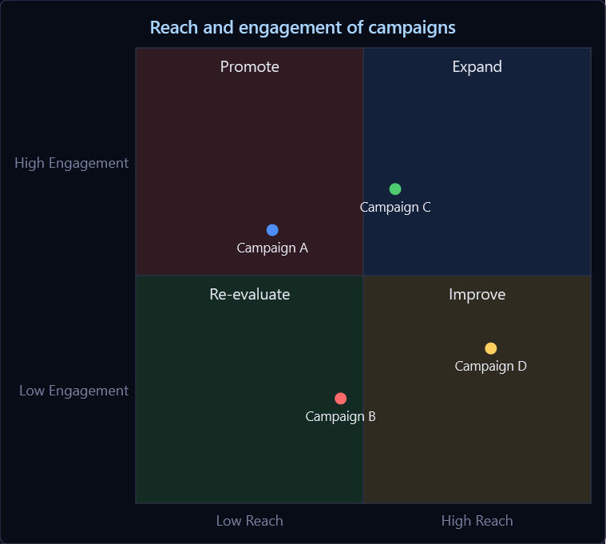

---

## Sankey diagram

Flows whose ribbon widths are proportional to value, with optional value labels and units.

````markdown
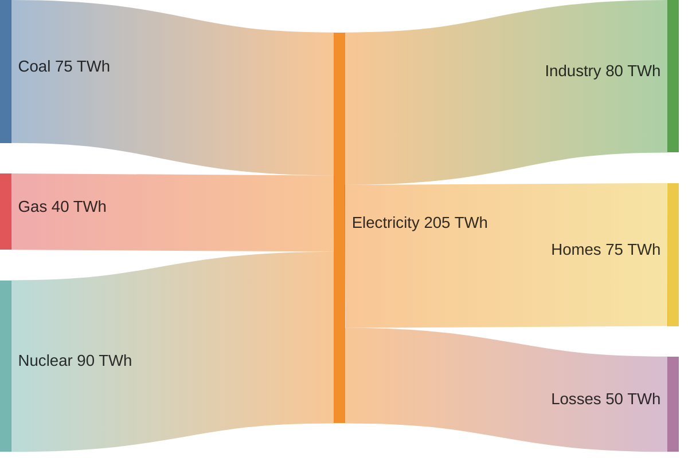
````

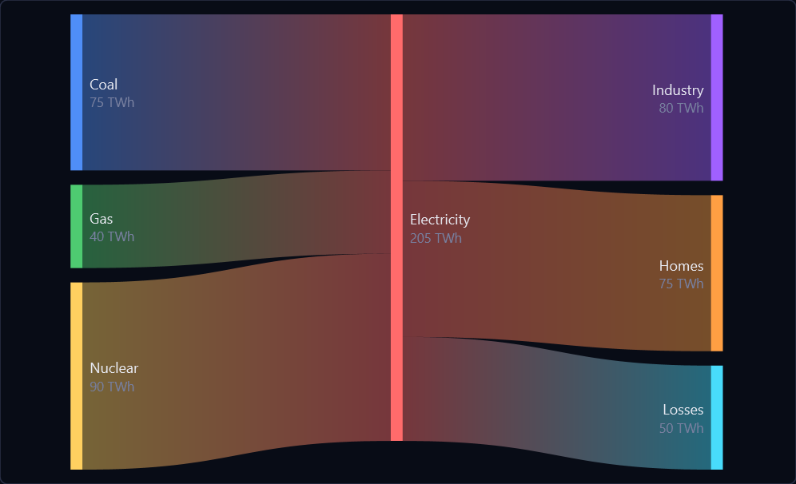

---

## Ishikawa (fishbone) diagram

Cause-and-effect / root-cause analysis: an effect on the spine, with categories and nested causes
branching off it.

````markdown
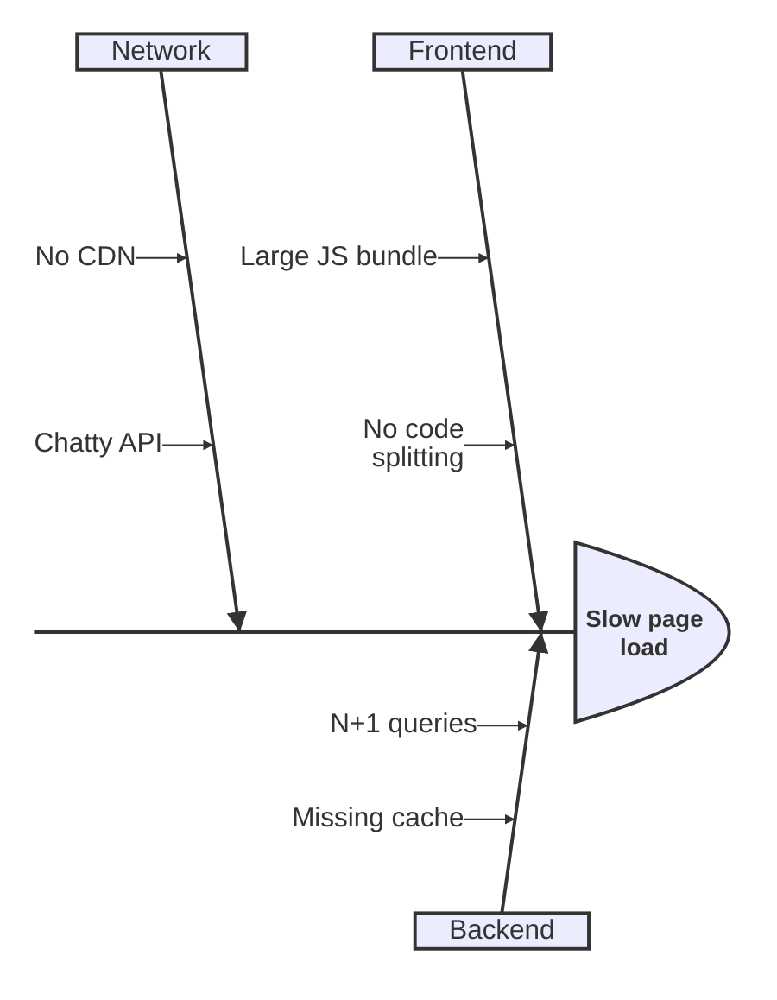
````

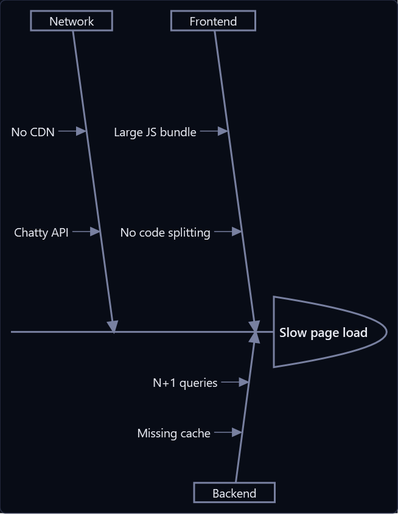

---

## Venn diagram

Overlapping sets, sized by weight, with labelled intersections.

````markdown
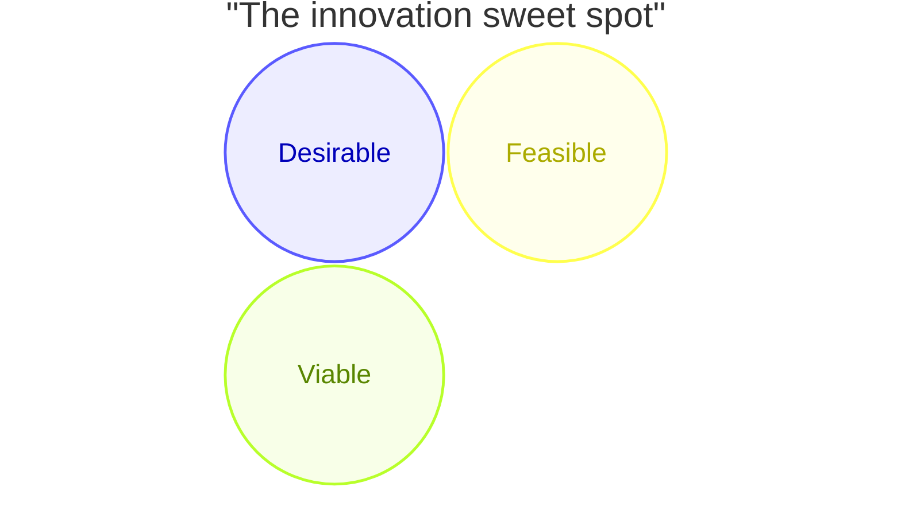
````

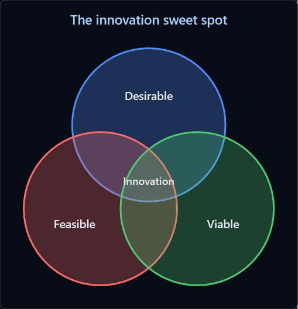

---

## Cynefin diagram

Sense-making: what is in hand sorted into the five domains — complex, complicated, chaotic and
clear in the corners, confusion as disorder in the middle — with the movements between them.

````markdown
```mermaid
cynefin-beta
    title Making sense of the incident
    complex
        "Run a safe-to-fail experiment"
    complicated
        "Consult an expert"
    clear
        "Apply the runbook"
    chaotic
        "Stop the bleeding"
    confusion
        "Unclassified report"
    chaotic --> complex : "Stabilised"
```
````

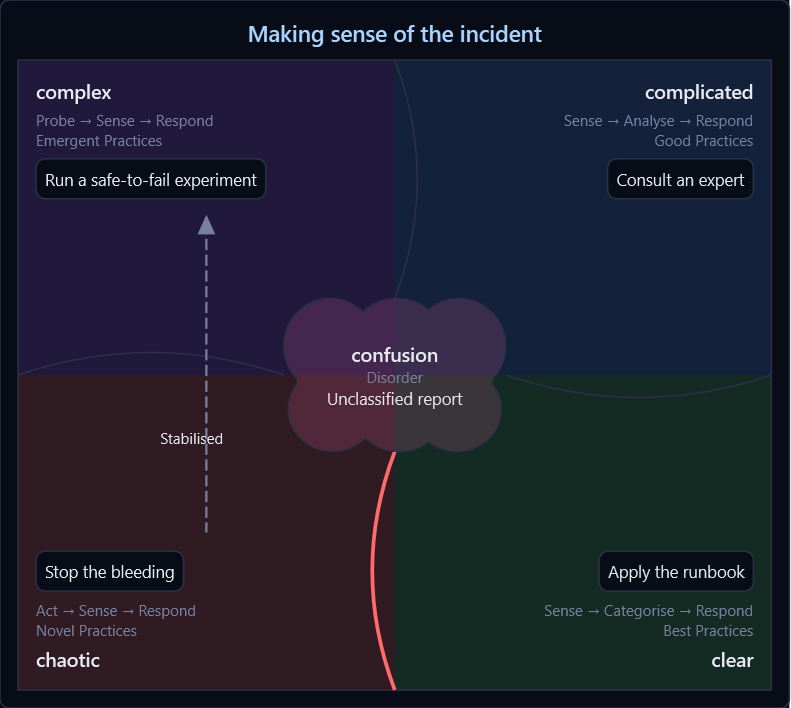

---

More diagram types in [Diagrams](help:MarkdownDiagrams). Back to [Markdown](help:Markdown).
