# Markdown — Diagrams: flow & structure

Diagrams for how something is built, and how it runs: flowcharts, sequence, class, state and ER diagrams, and the C4 family.

---

## Flowchart

Boxes, decisions and flows in any direction, with shaped nodes, labelled edges, subgraphs that gather them and classes that
colour them.

````markdown
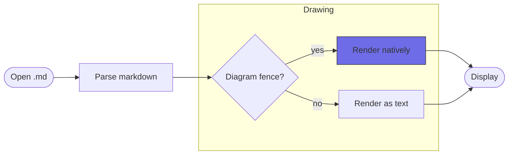
````

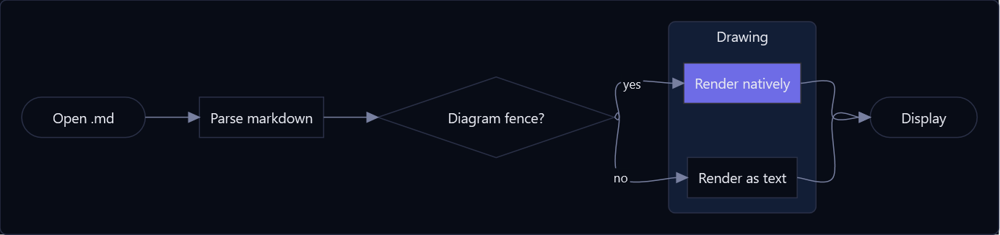

---

## Sequence diagram

Participants and the messages between them, including notes and async arrows.

````markdown
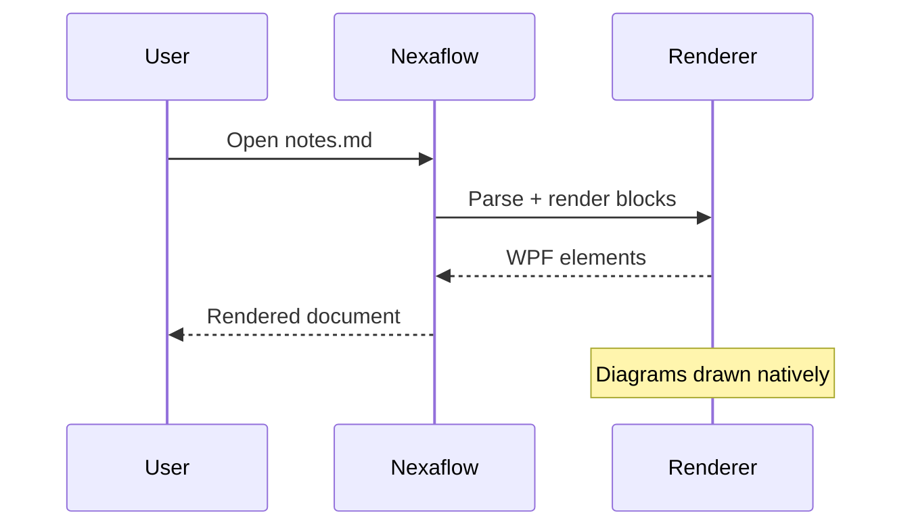
````

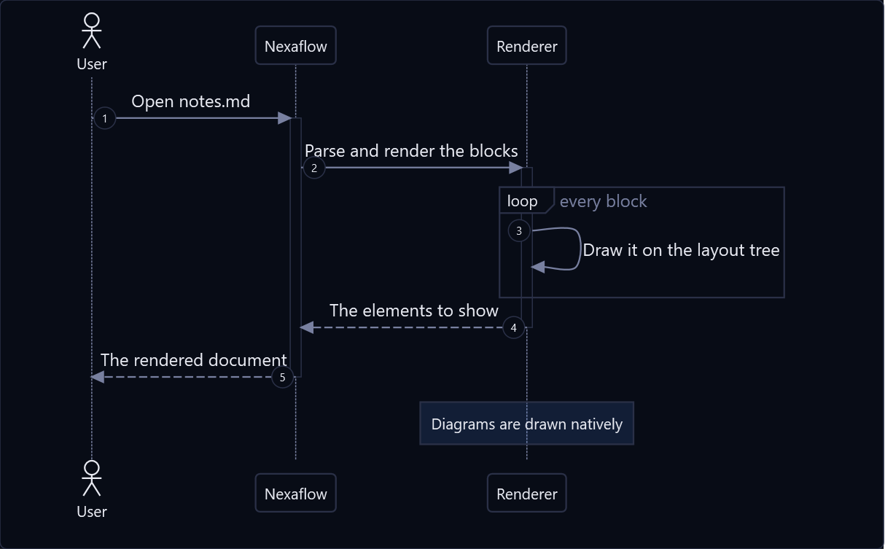

---

## Class diagram

UML classes with attribute and method compartments and the full relationship set.

````markdown
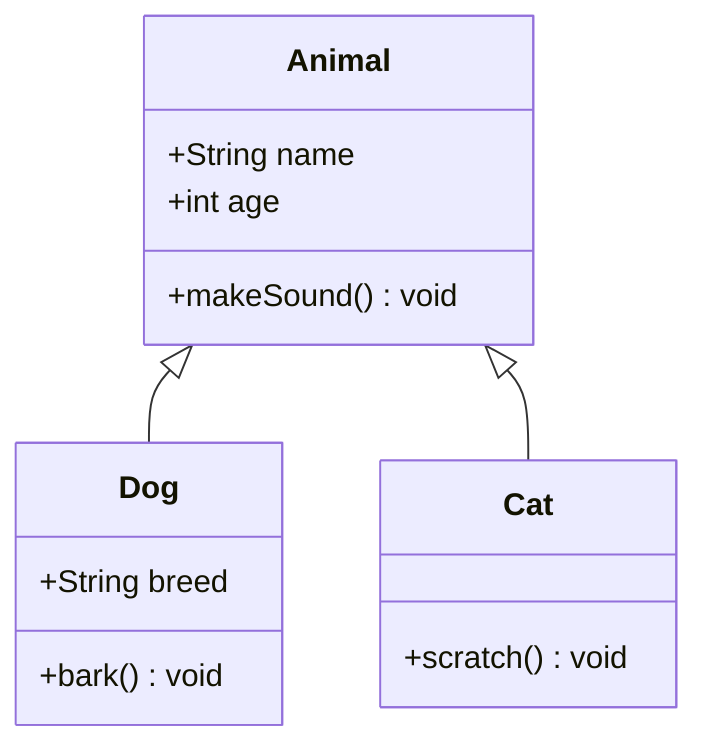
````

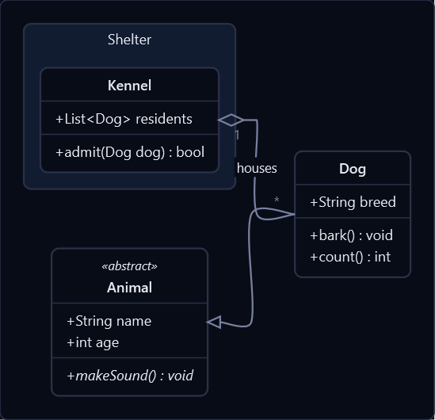

---

## State diagram

States, transitions, start/end markers and composite states.

````markdown
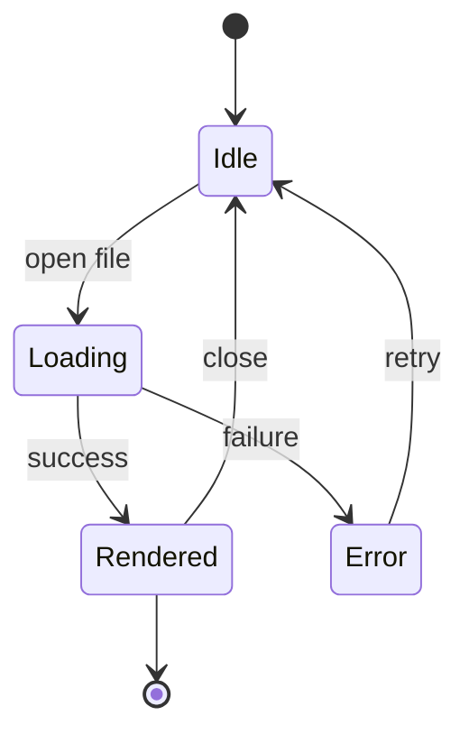
````

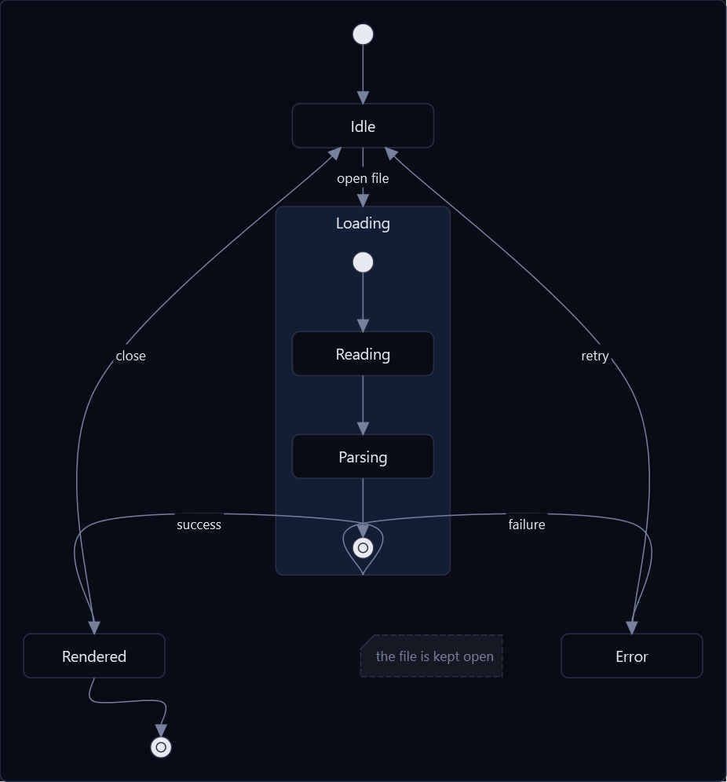

---

## Entity-relationship diagram

Entities with typed attributes and keys, joined by **crow's-foot** cardinality. Identifying
relationships use solid lines, non-identifying use dashed.

````markdown
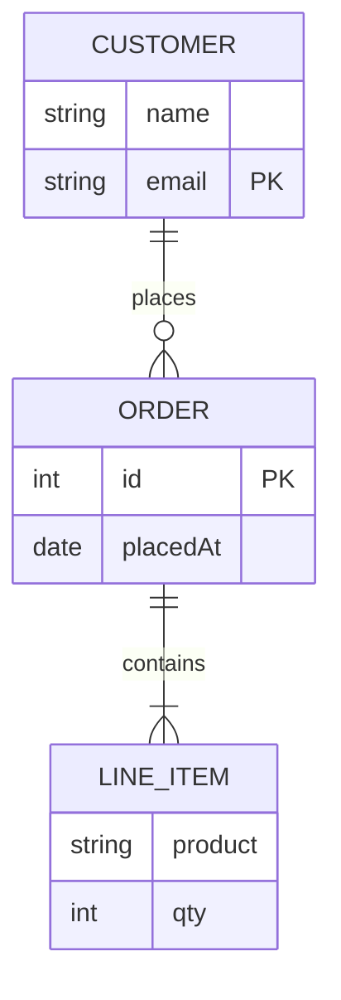
````

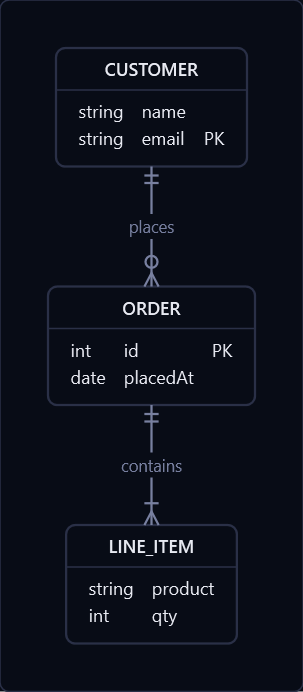

---

## Block diagram

Blocks on a grid you place yourself: columns, spans, spaces, nested blocks, fat block arrows and edges by id.

````markdown
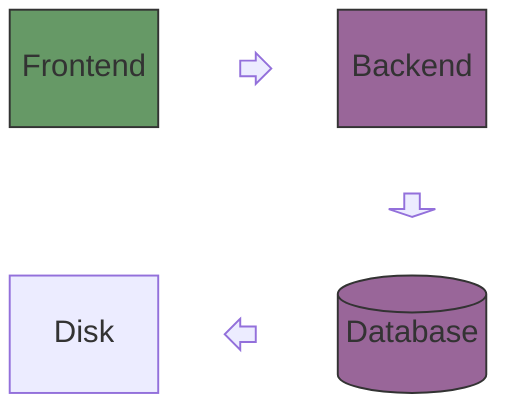
````

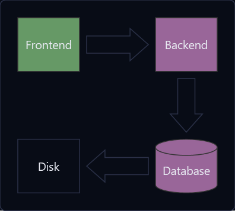

---

## Architecture diagram

Services laid out by the sides their edges leave by: groups box what is put in them, and a junction is where several edges
meet.

````markdown
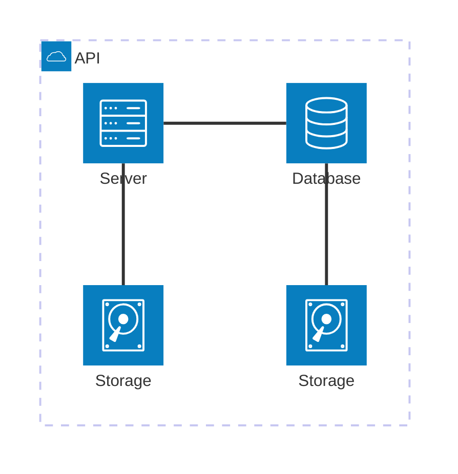
````

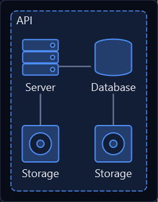

---

## C4 diagrams

Software architecture at C4's zoom levels — context, containers, components — plus deployment and dynamic views.
Elements are cards carrying their kind, technology and description; boundaries nest; relationships name the protocol
they run over.

````markdown
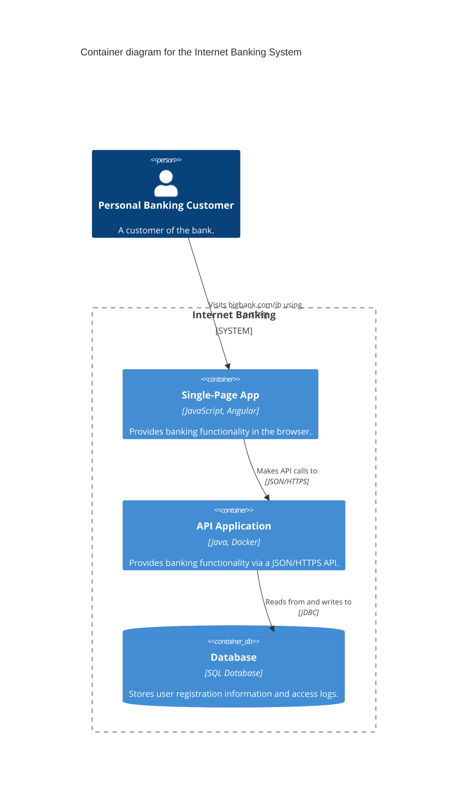
````

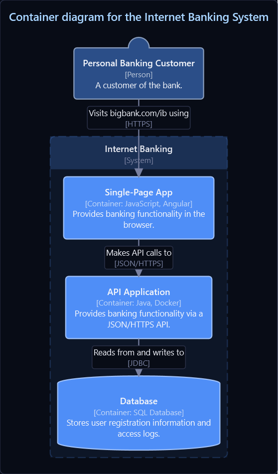

The body accepts the fuller [C4-PlantUML](https://github.com/plantuml-stdlib/C4-PlantUML) macro vocabulary — `$tags`
with `AddElementTag`, `UpdateElementStyle`, `SHOW_LEGEND`, `Deployment_Node` nesting, `RelIndex` numbering — not just
Mermaid's subset.

---

## C4 sequence

`C4Sequence` has no Mermaid equivalent — it mirrors C4-PlantUML's `C4_Sequence`, and is drawn by the *same* renderer as
a native sequence diagram, so native control lines work inside it.

````markdown
```mermaid
C4Sequence
title Sign-in sequence
SHOW_INDEX()

Person(customer, "Banking Customer")
Container(spa, "Single-Page App", "Angular")
Boundary(b, "API Application", "Container")
  Component(signin, "Sign In Controller", "Spring MVC")
  ComponentDb(users, "User Store", "Spring Bean")
Boundary_End()

Rel(customer, spa, "Submits credentials", "HTTPS")
Rel(spa, signin, "POST /signin", "JSON/HTTPS")
alt credentials valid
  Rel(signin, users, "Looks the user up", "JDBC")
else rejected
  Rel_Back(spa, signin, "401 Unauthorized")
end
```
````

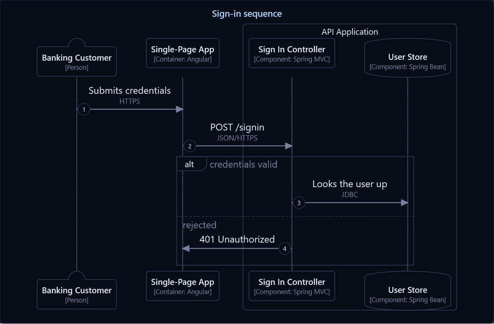

---

More diagram types in [Diagrams](help:MarkdownDiagrams). Back to [Markdown](help:Markdown).
