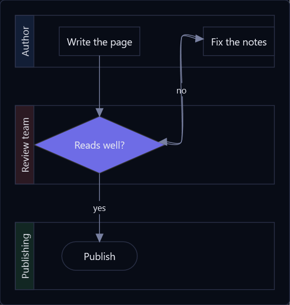
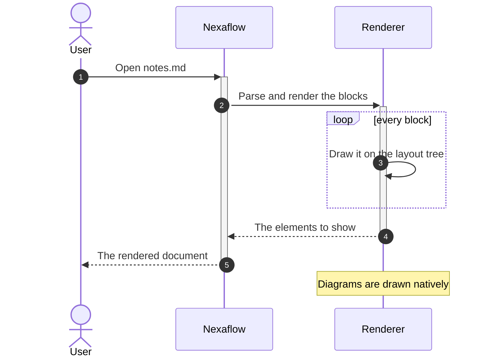
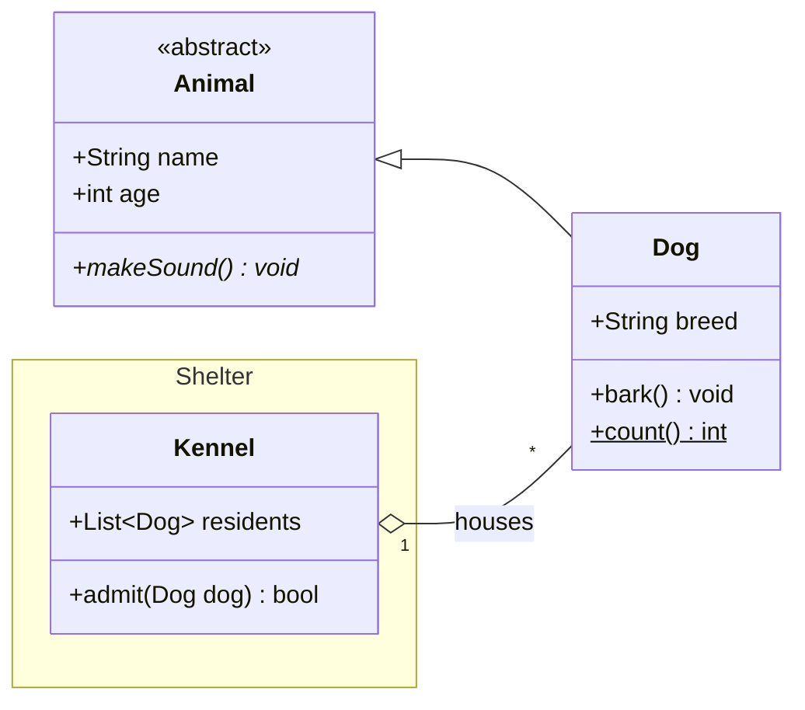
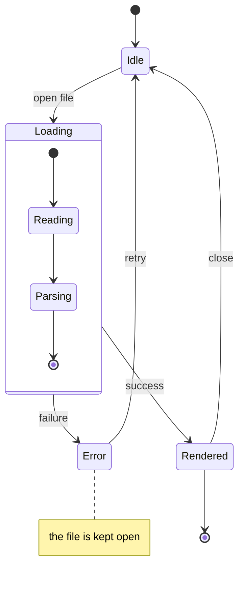
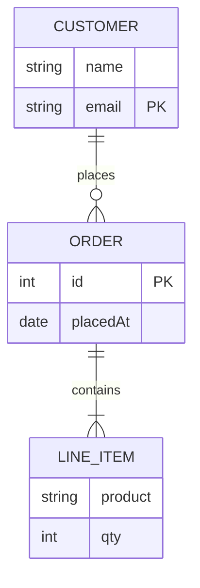
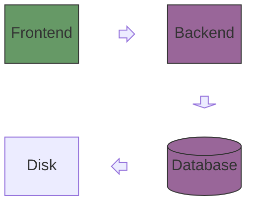
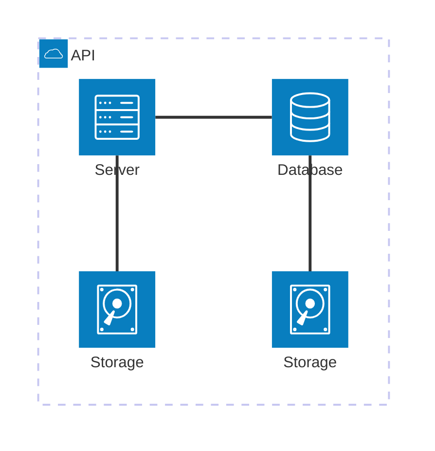
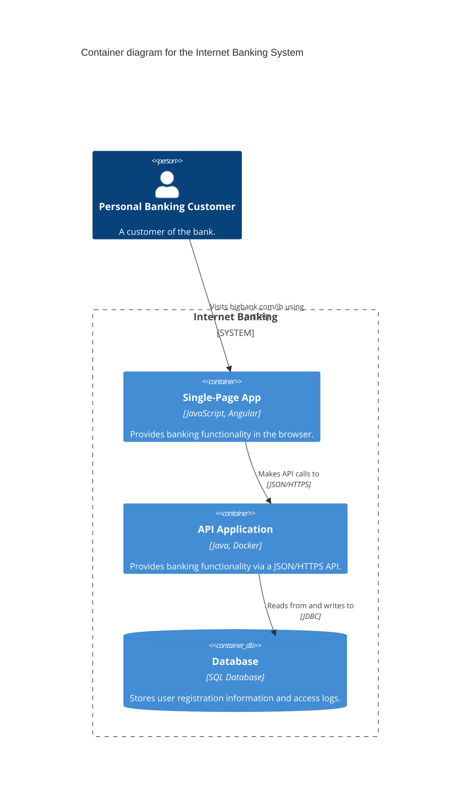

# Markdown — Diagrams: flow & structure

Diagrams for how something is built, and how it runs: flowcharts, swimlanes, sequence, class, state and ER diagrams, and
the C4 family.

---

## Flowchart

Boxes, decisions and flows in any direction, with shaped nodes, labelled edges, subgraphs that gather them and classes that
colour them.

````markdown

````


---

## Swimlane diagram

A flowchart divided by who owns each step. Every `subgraph` written outside them all is a lane — a band of its own, named at the
near end of it, that the work in it runs through — and an arrow from one lane to another is a handoff.

````markdown
```mermaid
swimlane-beta LR
    subgraph Author
        write[Write the page]
        fix[Fix the notes]
    end
    subgraph Review team
        read{Reads well?}
    end
    subgraph Publishing
        ship([Publish])
    end
    write --> read
    read -->|yes| ship
    read -->|no| fix
    fix --> read
    classDef waiting fill:#6e6ce6,stroke:#333
    class read waiting
```
````



---

## Sequence diagram

Participants and the messages between them: notes, numbering, the bar saying one is working, and the frames — `alt`,
`opt`, `loop`, `par`, `critical`, `break` — that hold a run of messages under a condition.

````markdown

````


---

## Class diagram

UML classes with attribute and method compartments, the full relationship set, namespaces, annotations and
how many of each class the other has.

````markdown

````


---

## State diagram

States, the transitions between them, the dots a scope starts and stops at, composite states and notes.

````markdown

````


---

## Entity-relationship diagram

Entities with typed attributes and keys, joined by **crow's-foot** cardinality. Identifying
relationships use solid lines, non-identifying use dashed.

````markdown

````


---

## Block diagram

Blocks on a grid you place yourself: columns, spans, spaces, nested blocks, fat block arrows and edges by id.

````markdown

````


---

## Architecture diagram

Services laid out by the sides their edges leave by: groups box what is put in them, and a junction is where several edges
meet.

````markdown

````


---

## C4 diagrams

Software architecture at C4's zoom levels — context, containers, components — plus deployment and dynamic views.
Elements are cards carrying their kind, technology and description; boundaries nest; relationships name the protocol
they run over.

````markdown

````


The body accepts the fuller [C4-PlantUML](https://github.com/plantuml-stdlib/C4-PlantUML) macro vocabulary — `$tags`
with `AddElementTag`, `UpdateElementStyle`, `SHOW_LEGEND`, `Deployment_Node` nesting, `RelIndex` numbering — not just
Mermaid's subset.

---

## C4 sequence

`C4Sequence` has no Mermaid equivalent — it mirrors C4-PlantUML's `C4_Sequence`. It is read into the same thing a
`sequenceDiagram` is read into and drawn by the same builder, so an element is a lifeline whose box is a card saying what
it is, a `Boundary` groups them, a `Rel` carries what it is done with — and `alt`, `loop`, `note over` and `activate`
work among the macros because they are the native grammar itself.

````markdown
```mermaid
C4Sequence
title Sign-in sequence
SHOW_INDEX()

Person(customer, "Banking Customer")
Container(spa, "Single-Page App", "Angular")
Boundary(b, "API Application", "Container")
  Component(signin, "Sign In Controller", "Spring MVC")
  ComponentDb(users, "User Store", "Spring Bean")
Boundary_End()

Rel(customer, spa, "Submits credentials", "HTTPS")
Rel(spa, signin, "POST /signin", "JSON/HTTPS")
alt credentials valid
  Rel(signin, users, "Looks the user up", "JDBC")
else rejected
  Rel_Back(spa, signin, "401 Unauthorized")
end
```
````


---

More diagram types in [Diagrams](help:MarkdownDiagrams). Back to [Markdown](help:Markdown).
