# Markdown — Diagrams: planning & time

Diagrams for what happens, in what order, and who it is for: requirements, Gantt charts, git graphs, kanban boards, mindmaps, timelines and user journeys.

---

## Requirement diagram

SysML-style requirements and the elements that meet them, with what holds between them — satisfy, verify, derive, contain.

````markdown
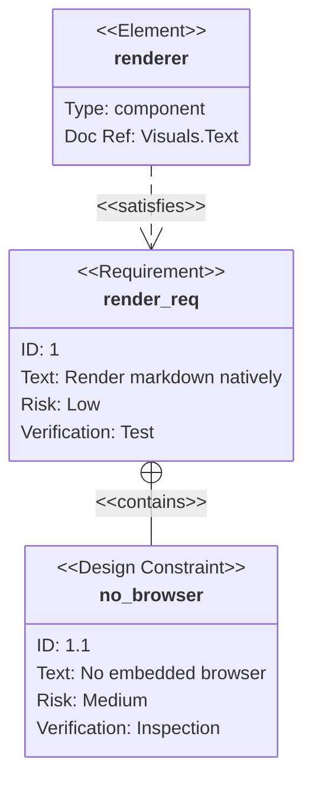
````

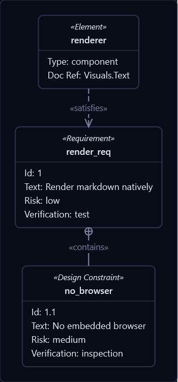

---

## Gantt chart

Project schedules with sections, dependencies (`after`, `until`), task states (`done` / `active` / `crit`), milestones,
vertical markers and excluded days. Task and section names are typed into where they are drawn.

````markdown
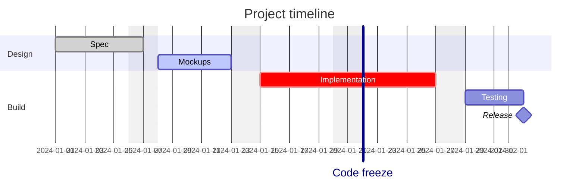
````


---

## Git graph

Commit history across branches, with merges.

````markdown
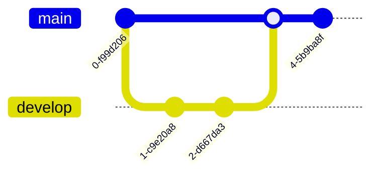
````

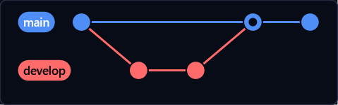

---

## Kanban board

Columns of cards with priority, assignee and ticket metadata — drawn as a real board.

````markdown
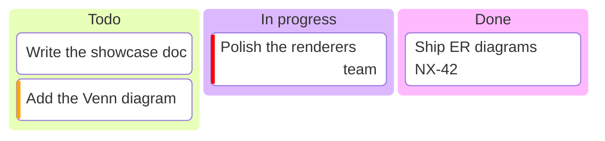
````

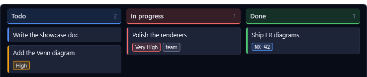

---

## Mindmap

Free-form hierarchies branching out from a central idea.

````markdown
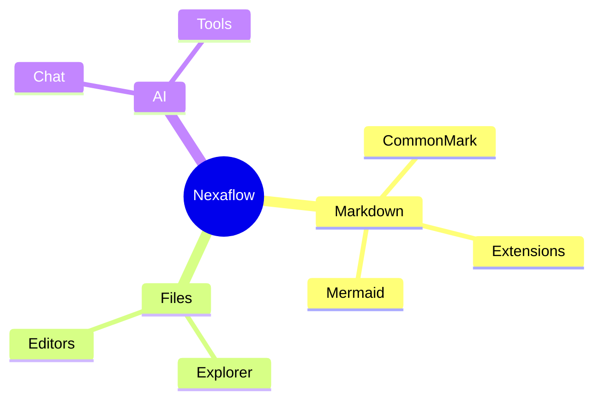
````

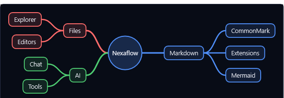

---

## Timeline

Periods along a spine, each with its events stacked beneath; sections band the periods they group.

````markdown
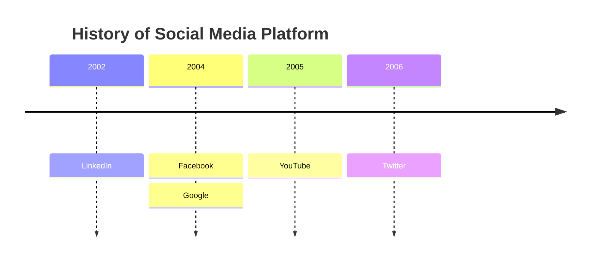
````

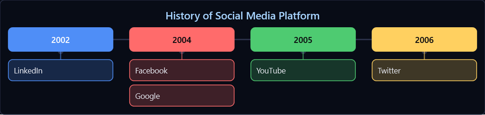

---

## User journey

Scored steps of a task: a face per score floats higher for a better experience, and each actor gets a colour.

````markdown
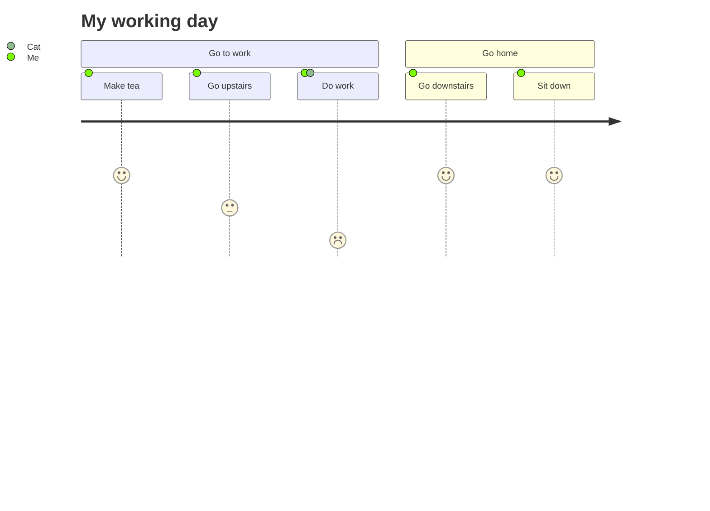
````

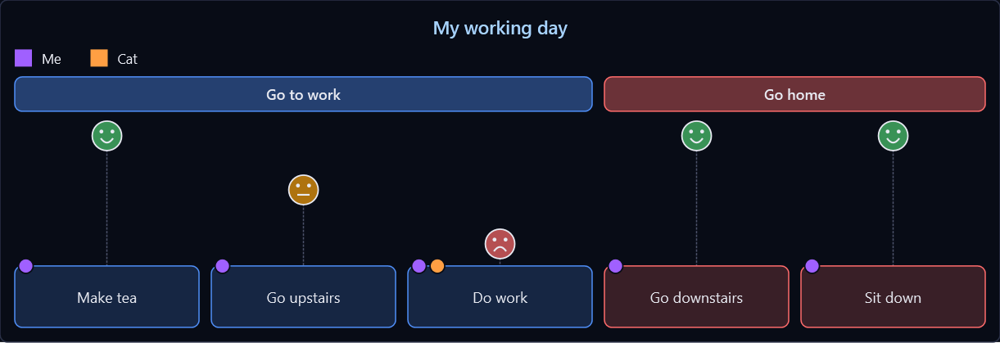

---

More diagram types in [Diagrams](help:MarkdownDiagrams). Back to [Markdown](help:Markdown).
