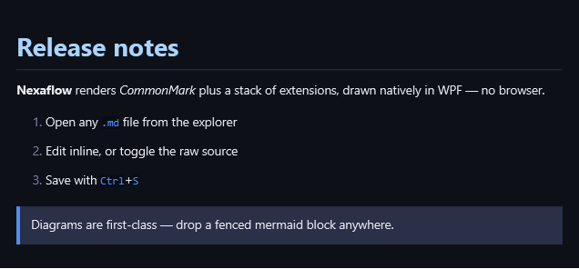
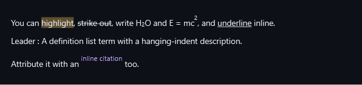

# Markdown

Nexaflow renders Markdown **natively** — no browser, no JavaScript, no round-trip to a web view.
Open a `.md` file and you get a fast, scrollable, fully-styled document: headings, tables, task
lists, callouts, real LaTeX math, and a complete family of diagrams drawn directly on the canvas.

This page covers reading and writing a document. The drawing — diagrams, codes, chemistry and
plots — is large enough to have pages of its own, listed under [More in a document](#more-in-a-document).

---

## Viewing & authoring

Markdown opens in its own tab — there's nothing to configure.

- **Open** — double-click any `.md` file in the file explorer (or open it from a project, a
  search result, or a snaplink). It lands in a Markdown tab.
- **Read & edit inline** — by default the tab shows the *rendered* document and lets you edit it in
  place: type into a heading, a list, or a paragraph and it stays formatted as you go.
- **Toggle the raw source** — flip the toolbar switch to drop to plain Markdown source when you want
  to hand-tune the exact text (front-matter, a fiddly table, a diagram fence), then flip back.
- **Save** — `Ctrl`+`S`. The tab tracks unsaved changes and the title shows when you're dirty.

Everything below works in both the rendered view and the preview — it's the same renderer.

---

## The basics

Standard CommonMark — headings, **bold**, _italic_, `inline code`, ordered and unordered lists,
links, and block quotes — all themed to match the app.

````markdown
# Release notes

**Nexaflow** renders _CommonMark_ plus a stack of extensions, drawn natively in WPF — no browser.

1. Open any `.md` file from the explorer
2. Edit inline, or toggle the raw source
3. Save with `Ctrl`+`S`

> Diagrams are first-class — drop a fenced mermaid block anywhere.
````



---

## Tables & task lists

Pipe tables support per-column alignment and inline formatting; task lists render as tidy
check glyphs.

````markdown
| Feature     | Status | Notes              |
|:------------|:------:|-------------------:|
| Pipe tables |   ✅   | alignment + inline |
| Task lists  |   ✅   | display glyphs     |
| Math        |   ✅   | LaTeX via WpfMath  |

- [x] Render tables
- [x] Render task lists
- [ ] Pour another coffee
````


---

## Callouts

GitHub-style alert blocks (`> [!NOTE]`, `[!TIP]`, `[!IMPORTANT]`, `[!WARNING]`, `[!CAUTION]`) become
coloured, labelled callouts.

````markdown
> [!NOTE]
> Diagrams render natively — no JavaScript, no browser.

> [!TIP]
> Toggle the raw source from the toolbar to tweak the markdown.

> [!WARNING]
> Remote images aren't fetched; only local files load.
````


---

## Rich inline extensions

Beyond CommonMark you also get highlight (`==`), strikethrough (`~~`), subscript (`~`), superscript
(`^`), underline (`++`), definition lists, and citations.

````markdown
You can ==highlight==, ~~strike out~~, write H~2~O and E = mc^2^, and ++underline++ inline.

Leader
: A definition list term with a hanging-indent description.

Attribute it with an ""inline citation"" too.
````



---

## Math

Block (`$$…$$`) and inline (`$…$`) LaTeX are typeset with real math layout.

````markdown
The Gaussian integral, rendered as real math:

$$\int_{-\infty}^{\infty} e^{-x^2}\,dx = \sqrt{\pi}$$

Inline math like $E = mc^2$ flows with the text.
````


---

## More in a document

These are drawn by the same renderer, on your machine, from a fenced block you type.

- **[Diagrams](help:MarkdownDiagrams)** — twenty-four Mermaid diagram types, from flowcharts and
  sequence diagrams to Gantt charts, mindmaps, Sankey diagrams and C4 models.
- **[QR codes & barcodes](help:MarkdownCodes)** — QR, linear barcodes, Data Matrix, PDF417 and Aztec.
- **[Chemistry, word clouds & plots](help:MarkdownScience)** — chemical structures from SMILES,
  shaped word clouds, and correlation plots over your own data.

---

## Good to know

- **It's all local.** Diagrams and math render on your machine — nothing is sent anywhere, and the
  renderer works offline.
- **Local images only.** `` loads local image files; remote `http(s)` and `data:` images are
  not fetched (you'll see the alt text instead).
- **Copy or save a picture of a diagram.** Rest the pointer on a pie chart, a Venn diagram, a formula or a
  chemical structure and a small toolbar appears at its top right: **Copy** puts a picture of it on the
  clipboard, and **Save** saves it as a PNG wherever you choose. The picture is the diagram as it reads —
  no caret, selection or placeholder boxes.
- **Front-matter config.** Several diagrams accept a `--- config: … ---` front-matter block to tune
  their look (colours, sizes, orientation) — see the XY, radar, Sankey and Venn examples in
  [Diagrams: charts & analysis](help:DiagramsCharts).
- **What a QR code *does* is the scanner's business, not the code's.** The same Wi-Fi code joins the
  network when scanned from Android's *add a network* screen and runs a web search when scanned from
  a home-screen search widget; a contact card offers to create a contact from inside the phone's
  Contacts app and to merge into an existing one from a general-purpose scanner. If a code seems not
  to work, scan it from the app that owns the thing it describes before suspecting the code.

For the engineering-level breakdown of exactly what's supported, see
[Markdown support](https://github.com/smile-forge/nexaflow/blob/main/docs/MarkdownSupport.md).
