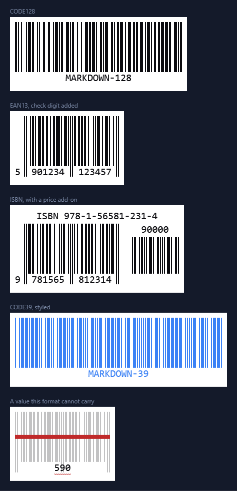
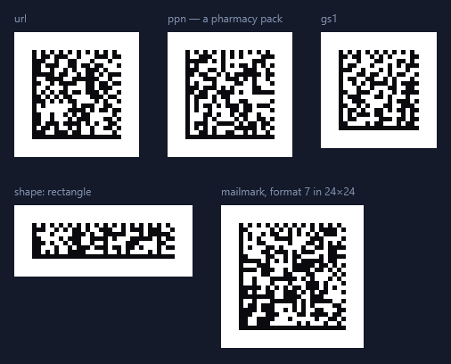
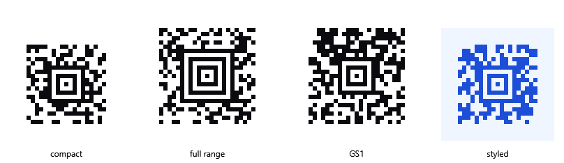

# Markdown — QR codes & barcodes

Machine-readable codes drawn from a fenced block: QR, linear barcodes, Data Matrix, PDF417 and Aztec.

---

## QR codes

A fenced `qr` block becomes a scannable QR code, generated on your machine like everything else here.
The body is a flat list of `key: value` lines — a `type:`, then the fields that type needs:

````markdown
```qr
type: url
url: https://markdown.org
```
````


The point of the `type:` is that a QR code only carries text — a phone offers to *join this network*
or *add this contact* because the text follows a convention. Writing the convention by hand is
miserable, so the block writes it for you:

| `type:` | Fields | What a scanner offers |
|---|---|---|
| `text` | `text` | Plain text |
| `url` | `url` | Open the link (a missing `https://` is filled in) |
| `email` | `email`, `subject`, `body` | Compose a message |
| `phone` | `phone` | Dial |
| `sms` | `number`, `message` | Send a text |
| `wifi` | `ssid`, `password`, `security`, `hidden` | Join the network |
| `vcard` | `name`, `org`, `title`, `phone`, `email`, `url`, `address` | Add the contact |
| `mecard` | `name`, `phone`, `email`, `url`, `address`, `note` | Add the contact, from a smaller code |
| `geo` | `lat`, `lng` | Open the map pin |
| `event` | `title`, `location`, `start`, `end` | Add to the calendar |
| `epc` | `name`, `iban`, `bic`, `amount`, `purpose`, `reference`, `message` | Prefill a bank transfer |
| `crypto` | `coin`, `address`, `amount` | Open the wallet |

`mecard` is the compact form of `vcard`: it drops the organisation and job title and produces a
noticeably smaller code, which older readers also handle more reliably. `epc` is the **GiroCode** seen
on European invoices — it takes euro amounts only, and either a structured `reference:` or free
`message:` text, not both. Its IBAN is checked (including the check digits) before the code is drawn,
because a mistyped one scans perfectly and then fails at the bank.

Any block can also carry these settings:

| Setting | Values | Default |
|---|---|---|
| `ec` | `L`, `M`, `Q`, `H` — how much damage the code survives | `M` |
| `cellSize` | pixels per module, 1–64 | `4` |
| `margin` | quiet zone in modules, 0–32 | `4` |
| `dark` | hex colour of the modules | the theme's |
| `light` | hex colour behind them | the theme's |

```qr
type: wifi
ssid: MyNetwork
password: s3cr3t-pass
security: WPA
ec: H
cellSize: 6
```

Higher error correction is worth it for anything that will be printed, put on a curved surface, or
partly covered — it costs capacity, so the same content needs a slightly larger code.

A block that can't be built says so in place of the picture, naming the line at fault: a misspelled
setting, a field belonging to another type, a missing required field, or content too long to fit.

---

## Barcodes

A fenced `barcode` block becomes a scannable linear barcode, generated on your machine like everything
else here. The body is a flat list of `key: value` lines — a `format:`, a `value:`, and whatever
settings you want:

````markdown
```barcode
format: EAN13
value: 590123412345
```
````



**What you typed is editable where it is drawn; what the format worked out is not.** Click into the
digits and type — the symbol re-encodes as you go, and the change goes back into the fence in your
document.

Most of these formats do not print exactly what they are given, and the caret goes only where they
do. Codabar wraps your value in the start and stop marks it needs, so those two characters take no
caret and the rest does. An EAN-13 works out its thirteenth digit from the other twelve, so the
twelfth is the last place you can stand. A UPC-E given six digits fills in both ends. An ISBN is the
furthest from what you typed — the digits under its bars are your number with the hyphens taken out
and a check digit added — so none of them is editable, and the caption above the bars, which is your
number as you wrote it, is where you edit it.

Everything is still selectable and copyable either way, and pressing a digit the format worked out
selects the whole number it was worked out from. Where a symbol takes no caret at all, edit it in the
block source: double-click to open it.

### Formats

| `format:` | Carries | Notes |
|---|---|---|
| `CODE128` | Any ASCII | Moves between its subsets to keep the symbol short |
| `CODE128A` / `CODE128B` / `CODE128C` | One subset each | When a scanner insists on one |
| `EAN13` / `EAN8` | 12 or 7 digits | The check digit is computed, or verified if you write it |
| `UPC` (`UPCA`) / `UPCE` | 11 or 7 digits | `UPC` and `UPCA` are the same thing |
| `EAN2` / `EAN5` | 2 or 5 digits | The add-on block, on its own |
| `ISBN` / `ISSN` / `ISMN` | The number as printed | Hyphens and all; add a space and an add-on for a price or issue |
| `CODE39` | Digits, capitals, `- . $ / + % space` | The old workhorse |
| `ITF` / `ITF14` | An even number of digits | `ITF14` is the shipping-carton one, and adds its own check digit |
| `MSI`, `MSI10`, `MSI11`, `MSI1010`, `MSI1110` | Digits | The suffix says which check digits to add |
| `PHARMACODE` | 3–131070 | Read right to left, by design |
| `CODABAR` | Digits and `- $ : / . +` | Start/stop letters `A`–`D` are added if you leave them off |

The retail formats are drawn the way they are printed: the number broken at the guard bars into the
groups that sit in the wells between them, the first digit set outside the symbol, the guards running
down past the digits, and an add-on's digits above its own bars. The shape is how these are recognised
at a glance, so it is worth getting right even though a scanner only reads the bars.

An ISBN, ISSN or ISMN is not a symbology — each is a numbering scheme that agreed to be *printed* as
an EAN-13 by reserving a prefix. So these work out which thirteen digits your number stands for, print
it under the scheme's own name, and hand the bars to EAN-13. A ten-digit ISBN is promoted the way the
standard says. Anything after a space is the add-on:

````markdown
```barcode
format: ISBN
value: 978-1-56581-231-4 90000
```
````

### Settings

| Setting | Values | Default |
|---|---|---|
| `width` | width of a **single bar** in pixels, 0.5–20 | `2` |
| `height` | bar height in pixels, 4–1000 | `100` |
| `displayValue` | `true` / `false` — print the number under the bars | `true` |
| `fontSize` | pixels, 4–200 | `20` |
| `textAlign` | `left`, `center`, `right` | `center` |
| `lineColor` | hex colour of the bars | the theme's |
| `background` | hex colour behind them | the theme's |
| `margin` | quiet zone in pixels, 0–200 | `10` |

`width` is the width of one bar, not of the whole symbol — that follows from the value, since a
barcode's length is decided by what it encodes. Doubling `width` doubles the symbol.

### When it can't be drawn

The two ways a block can be wrong are treated differently, because only one of them is your problem
while you are typing:

- A block that can't be **understood** — an unknown setting, a format that doesn't exist, a width
  that isn't a number — is shown as its source with the reason above it. There is nothing to draw.
- A value the format can't **carry** still renders. The bars of a valid value in that format are
  drawn faint with a line struck through them, and a red wave goes under the value; hovering says
  why. This matters because a value is invalid every time you are halfway through changing it — an
  EAN-13 has the wrong number of digits for all but the last keystroke.

---

## Data Matrix

A fenced `datamatrix` block becomes a Data Matrix symbol — the ECC 200 kind on every parcel label and
pharmacy pack — generated on your machine. It takes exactly the `type:` lines a `qr` block does, because
a Wi-Fi descriptor or a vCard decodes the same from either symbol, plus the formats that exist *only* as
Data Matrix:

````markdown
```datamatrix
type: ppn
pzn: 01234562
lot: A1B2
expiry: 271231
```
````



| `type:` | Fields | Encodes as |
|---|---|---|
| *every `qr` type* | as for `qr` | the same text — `WIFI:…`, `mailto:`, a vCard |
| `gs1` | `data` | a GS1 element string, written with each AI in brackets: `(01)04150012345623(17)271231(10)LOT7`. FNC1 first, brackets off, a separator after each variable-length element that is followed by another |
| `ppn` | `pzn`, `lot`, `expiry`, `serial` | a German pharmacy pack: the PPN is derived from the PZN with both checks computed, and the fields go under MH10.8.2 identifiers wrapped in Macro 06 |
| `ntin` | `pzn` or `gtin`, `expiry`, `lot`, `serial` | the same pack as GS1 sees it — an NTIN under AI 01, derived from the PZN, with 17, 10 and 21 |
| `mailmark` | `format`, `message` | a Royal Mail Mailmark 2D: format 7 is 51 characters in 24×24, 9 is 90 in 32×32, 29 is 70 in 16×48. The size is not a choice — it is what Royal Mail's readers expect for the format |

The check digits are the reason `ppn` and `ntin` take a PZN rather than the finished number: a PZN's
own check is verified, the PPN's two check characters and the NTIN's mod-10 are computed, and a
mistyped one is refused before anything is drawn.

The smallest symbol that fits is chosen, square or rectangular. Two settings steer that, on top of the
`cellSize` / `margin` / `dark` / `light` a `qr` block takes:

| Setting | Values | Default |
|---|---|---|
| `shape` | `square`, `rectangle`, `any` | `any` |
| `size` | a size the standard defines, `rows×columns` — `10x10` to `144x144`, or one of `8x18`, `8x32`, `12x26`, `12x36`, `16x36`, `16x48` | the smallest that fits |

Text is written in whichever of the two encodations makes it shorter: ASCII, which carries anything,
or C40, which packs three capitals into two codewords and is what lets a Mailmark's ninety characters
fit the symbol its format mandates. Anything outside ASCII goes as UTF-8, with the symbol saying so.

---

## PDF417

A fenced `pdf417` block becomes a PDF417 symbol — the stacked barcode on driving licences, boarding
passes and shipping labels. It takes the same `type:` lines a `qr` block does:

````markdown
```pdf417
type: url
url: https://markdown.org
columns: 4
```
````

It is stacked rather than square: each row is an independent line of bars, and every row carries
indicators saying which row it is and how the symbol is shaped. That is what lets a scanner piece one
together from rows read out of order, or in strips, as a parcel goes past.

| Setting | Values | Default |
|---|---|---|
| `columns` | data columns, 1–30 | a symbol about three times as wide as it is tall |
| `ec` | error correction, 0–8 — each level spends 2^(level+1) codewords on parity | by payload size, as the standard recommends |
| `rowHeight` | how tall a row is drawn, in module widths, 2–20 | `3` |
| `truncated` | `true` drops the right row indicator and the stop pattern | `false` |

plus the `cellSize` / `margin` / `dark` / `light` a `qr` block takes.

`rowHeight` exists because a row carries nothing in its height — the standard asks for at least three
module widths so a scanner sweeping across the symbol stays inside one row. Truncating saves eighteen
modules a row and is worth it on a document that will not be damaged at its right edge; not on a parcel.

Text is packed two characters to a codeword, and a long run of digits switches to a denser numeric
mode automatically. Anything that will not fit either goes as bytes.

---

## Aztec Code

A fenced `aztec` block becomes an Aztec Code — the symbology on rail and air tickets. It takes the same
`type:` lines a `qr` block does, plus GS1 element strings:

````markdown
```aztec
type: url
url: https://markdown.org
```
````



Its finder pattern is a bullseye in the middle rather than three squares in the corners, which is why an
Aztec code needs almost no quiet zone around it — handy on a ticket where there is no room to spare. It
also has no version table: a symbol grows one two-module ring at a time, so a message of any length gets
a symbol barely larger than it needs.

There are two families. A **compact** symbol has an eleven-module core and up to four rings; the **full
range** has a fifteen-module core, up to thirty-two rings, and a reference grid running through its
larger sizes to keep a reader registered across a big symbol. Compact is smaller for the same message,
so that is what you get unless you say otherwise or the message outgrows it.

| Setting | Values | Default |
|---|---|---|
| `format` | `compact`, `full` or `auto` | `auto` — compact while the message fits |
| `layers` | rings around the core: 1–4 compact, 1–32 full | the smallest that fits |
| `ecc` | least share of the symbol that is error correction, 0–95 | `23`, which is what the standard advises |
| `eci` | an ECI number declaring the character set | none — bytes are UTF-8 |

plus the `cellSize` / `margin` / `dark` / `light` a `qr` block takes.

`ecc` is a floor rather than a target: whatever capacity the message leaves over becomes error correction
too, so a short message in a symbol sized for it often ends up eighty per cent parity. Raising `ecc`
therefore changes the answer only when it forces a larger symbol. `layers` is the other way about — it
fixes the size outright, for a printed form with a box to fill, and fails rather than growing when the
message will not fit.

A `gs1` block takes an element string as people write it — `(01)04150123456782(10)LOT7(21)SN9` — and puts
the wire form in the symbol: brackets off, FNC1 in front, and a group separator after each
variable-length element that needs one.

Not supported: Aztec Runes, reader-initialisation symbols, and structured append across several symbols.

---

Back to [Markdown](help:Markdown).
