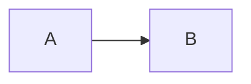

# Markdown — Diagrams

Twenty-four Mermaid diagram types, drawn natively on the canvas from a fenced block.

---

This is where Nexaflow goes furthest. Drop a fenced `mermaid` block into any document and it's drawn
**natively** — there's no diagram server and no embedded browser. Every diagram on these pages was produced by
the built-in renderer.

To create one, just fence your diagram with `mermaid`:

````markdown

````

The pages below walk through every supported diagram type.

---

## The diagram types

**[Flow & structure](help:DiagramsFlowAndStructure)** — how something is built, or how it runs.

- Flowchart, sequence diagram, class diagram, state diagram, entity-relationship diagram
- Block diagram, architecture diagram, C4 diagrams, C4 sequence

**[Planning & time](help:DiagramsPlanning)** — what happens, in what order, and who it is for.

- Requirement diagram, Gantt chart, git graph, kanban board, mindmap, timeline, user journey

**[Charts & analysis](help:DiagramsCharts)** — proportion, distribution, comparison and cause.

- Pie chart, XY chart, radar chart, quadrant chart, Sankey diagram
- Ishikawa (fishbone) diagram, Venn diagram, Cynefin diagram

Back to [Markdown](help:Markdown).
