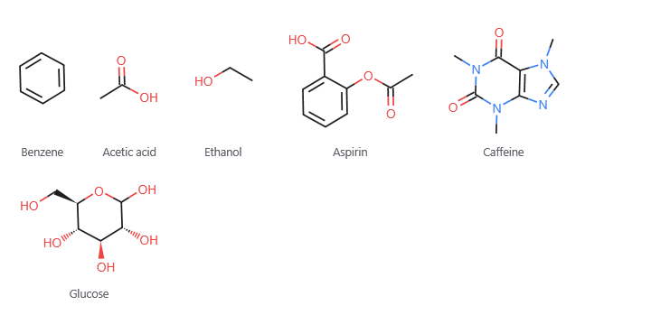
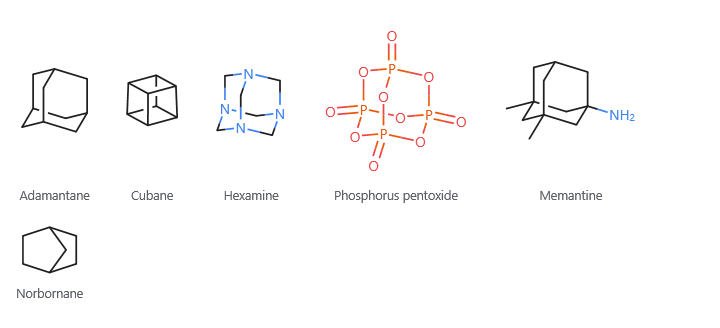
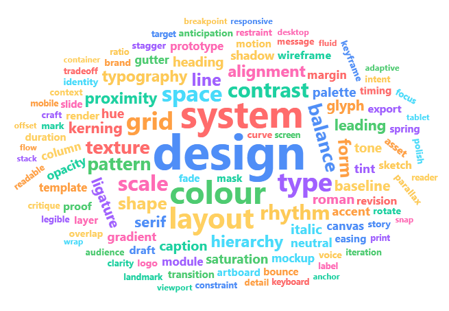
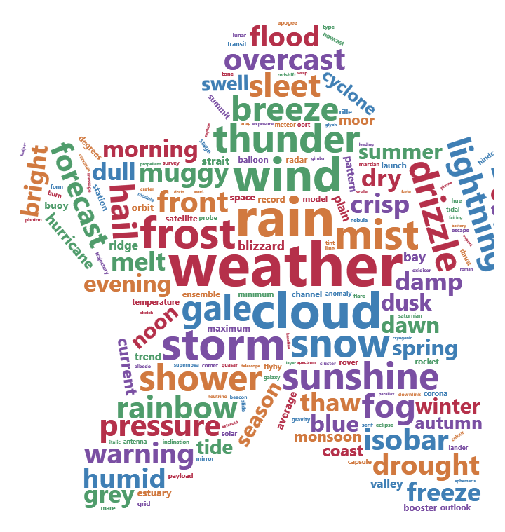
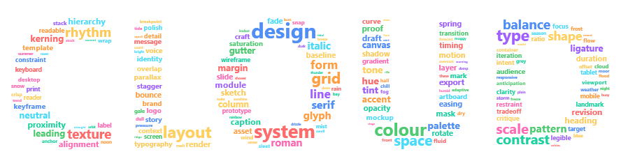

# Markdown — Chemistry, word clouds & plots

Chemical structures from SMILES, shaped word clouds, and correlation plots over your own data.

---

## Chemical structures

A fenced `smiles` block draws molecules from their SMILES strings — one per line, with an optional
caption in double quotes. The word `chemistry` may open the block, and a line starting with `#` is a
comment:

````markdown
```smiles
chemistry
c1ccccc1 "Benzene"
CC(=O)O "Acetic acid"
CCO "Ethanol"
```
````



Structures are drawn the way a chemistry textbook draws them: carbon as the corner where bonds meet,
every other element as its symbol in its usual colour, with its hydrogens written beside it. Aromatic
rings get alternating double bonds, and several molecules in a block flow across the page.

| You write | You get |
|---|---|
| `CCO` | atoms side by side are bonded; hydrogens are filled in for you |
| `=` `#` | a double or triple bond |
| `CC(C)CO` | a branch in round brackets |
| `c1ccccc1` | matching digits close a ring; lowercase letters make it aromatic |
| `[NH4+]` `[13CH4]` `[Fe+2]` | an atom in square brackets with its hydrogens, charge or mass number |
| `N[C@@H](C)C(=O)O` | a stereocentre, drawn with a wedge |
| `C/C=C\C` | which side of a double bond each end goes on (here, cis) |
| `[Na+].[Cl-]` | a dot separates molecules drawn side by side |

### Cages

Some molecules are closed cages whose rings share several atoms — adamantane, cubane, hexamine,
phosphorus pentoxide. No flat drawing shows these, so they are drawn the way a textbook draws them: as a
picture of the solid seen from a slight angle, with a bond at the back broken where it passes behind one
at the front. A bicycle that reads clearly flat, like norbornane, stays flat.

````markdown
```smiles
C1C2CC3CC1CC(C2)C3 "Adamantane"
C12C3C4C1C5C2C3C45 "Cubane"
O=P12OP3(=O)OP(=O)(O1)OP(=O)(O2)O3 "Phosphorus pentoxide"
```
````



### When it can't be drawn

A string that cannot be a molecule still draws as much as it can, with the reason in red beneath and a
wavy line under the atom at fault — a carbon with five bonds, a ring number that never closes, or an
aromatic ring that cannot alternate. The most common one is a five-membered ring's nitrogen written `n`
when it carries a hydrogen: write it `[nH]`, as in pyrrole, `c1cc[nH]c1`.

A structure is read-only on the page, but you can select across it and copy the SMILES it was drawn from.

---

## Word clouds

A fenced `wordcloud` block packs words into a picture, each set at the size its weight comes to. Every
line is `something: value`. Settings go at the top; the first word ends them, and from there every line is
a word and what it counts for — so a cloud can count `shape`, `scale` or `colour` without losing its
shape. A line starting with `#` is a comment:

````markdown
```wordcloud
WPF: 120
XAML: 96
MVVM: 74
tabs: 61
terminal: 55
markdown: 50
```
````



The heaviest word goes in first and takes the middle; the rest fill in around it, each dropping into the
first gap it fits. Words are fitted by the shape of their letters, not by the box around them, so a short
word slides under a capital's arm — which is what makes a cloud look like a cloud rather than like a wall.

**A cloud needs words.** A dozen of them is a dozen words with space around them; it takes a hundred or
more before the packing has anything to pack, and a few hundred before a `shape:` reads as one.

**The picture is what was drawn.** `width:` and `height:` say how much room the packing may use, not how
big the picture is: it is trimmed to the words, so a handful of them is a small picture rather than a few
words marooned in the middle of the page. With no `width:`, the cloud is given the column it sits in.

### Shapes, turns and colours

````markdown
```wordcloud
shape: star
scale: log
rotate: 0.15
color: #b5304a #d1793f #3f7fb5 #4f9c6b #7a4fa3
weather: 1200
rain: 715
cloud: 528
```
````



| You write | You get |
|---|---|
| `shape: star` | the outline the words are packed into: `circle`, `cardioid`, `diamond`, `square`, `triangle`, `triangle-forward`, `pentagon`, `star`. Nothing is clipped — the words simply run out where the outline is, so the shape shows best with plenty of words |
| `letters: CLOUD` | pack the cloud into the shape of those letters instead |
| `mask: heart.png` | pack it into the shape a picture holds — its opaque part if it has transparency, its dark part if it has not. The picture is found beside your document, exactly as `` would find it |
| `rotate: 0.3` | the share of the words turned, from `0` to `1`. They take any angle between `minRotation:` and `maxRotation:` (`-90` to `90` by default); `rotationSteps: 2` gives the tidier look of words either level or on their side, and nothing in between |
| `color: theme` | the app's chart colours, taken in turn — so the cloud follows your theme. Write colours instead (`#b5304a #3f7fb5`) to use those, or `random-dark` / `random-light` to scatter them |
| `background: #101010` | what the picture is drawn on. Without it, the page shows through |
| `minSize: 12` `maxSize: 72` | the sizes the lightest and heaviest words are set at. Everything between is spread by `scale:` — `sqrt` (the default), `linear` or `log` for counts spread over orders of magnitude |
| `font: Georgia` `bold: no` | the face the words are set in |
| `gap: 4` | clear air kept around every word. `gridSize:` is how finely the letters are fitted — smaller packs tighter and takes longer |
| `seed: 7` | the same block always draws the same cloud; change the seed to shuffle it into a different arrangement |

If the very first word is named like a setting, write it in quotes — that makes a word of it wherever it
stands:

````markdown
```wordcloud
shape: circle
"shape": 40
"color": 34
```
````

### Letters and pictures

`shape:` bends the cloud towards an outline. `letters:` and `mask:` do something stronger: they mark out
where the words may go at all, so the cloud fills a shape rather than merely tending towards one.

````markdown
```wordcloud
letters: CLOUD
minSize: 4
maxSize: 30
scale: log
design: 900
system: 594
colour: 456
```
````



Keep `maxSize:` well down when you do this — the words have to be small against the letters, or there is
nothing left of the shape to read. `mask:` works the same way with a picture: draw your shape in black on
white (or as a transparent PNG), put it beside the document, and name it.

**You can type into it.** Click into any word in the picture and edit it where it stands — the block
follows. The weights are not drawn, so those are edited in the block's source.

### When it can't be drawn

A weight that is not a number leaves a wavy line under that line and the rest of the words still draw; so
does a word there was no room left for, because a word silently missing from a cloud is a word you would
believe was never counted. A setting given something it cannot take — a shape that does not exist, a width
that is not a number — stops the block being a cloud at all, and it shows its own lines with the reason.

---

## Correlation plots

Four fenced blocks draw a table of values against a pair of axes: `scatter`, `bubble`, `heatmap` and
`density2d`. They are written the same way, so anything below works in all four.

**The smallest plot is two columns of numbers.** The first is across, the second is up.

```scatter
1.2  3.4
2.5  5.1
3.1  6.8
```

**Name the columns** with a first row that is words rather than numbers, and the names become the axis
titles. Spaces or commas separate cells alike.

```scatter
weight  mpg
2620    21.0
3440    18.7
1615    30.4
```

**Settings go above the table**, one `key: value` to a line. The first row of the table closes them, so
a column headed `size` is still a column. A `#` starts a comment.

**A setting that names a column maps it; anything else applies to every mark.** So `colour: origin` tells
your groups apart, and `size: 4` sets the size of all of them.

| To | Write |
|---|---|
| name it | `title:` `subtitle:` `caption:` `xTitle:` `yTitle:` `legendTitle:` |
| say where the marks go | `x:` `y:` |
| tell groups apart | `colour:` `shape:` `group:` — a column name, or a colour or mark name |
| size the marks | `size:` — a column name, or a number; `sizeRange: 4 28` |
| fade or name them | `alpha:` a column or a number, `alphaRange: 0.2 1`; `label:` a column to name each mark |
| unstack them | `jitter: 0.4` — moves marks off their place so equal rows stop hiding each other |
| shape the panel | `aspect: 1` for square, `flip: true` to swap the axes |
| draw something else | `geom: point`, `tile`, `bin2d`, `hex`, `density2d`, `corr` |
| split it into panels | `facet:` a column, `facetCols: 3` for how many across |
| fit a line through them | `fit: lm` or `loess`, with `se: true` for the band |
| report the correlation | `stats: r r2 n p`, and `method: pearson`, `spearman` or `kendall` |
| change an axis | `xScale: log`, `xLimits: 0 100`, `xBreaks: 0 50 100`, `grid: none` |
| change the colours | `palette:`, `gradient: viridis`, `midpoint: 0`, `legend: bottom` |

**A correlation, with the line and the figures:**

```scatter
title: Weight against fuel economy
fit: lm
stats: r r2 n

weight  mpg
2620    21.0
3440    18.7
5250    10.4
1615    30.4
1935    27.3
```

**A correlation matrix** is a `heatmap` whose rows are each one cell wider than the header — which is how
you would write one anyway. `midpoint: 0` makes the colour mean the sign.

```heatmap
gradient: rdbu
midpoint: 0
fillLimits: -1 1
labels: true

       mpg    hp     wt
mpg    1.00  -0.78  -0.87
hp    -0.78   1.00   0.66
wt    -0.87   0.66   1.00
```

**Or let it work the matrix out for you.** Give a `heatmap` your observations and `geom: corr`, and every
numeric column is correlated with every other — `method:` choosing which coefficient, `labels: true`
writing each one on its tile. A tile is worked out rather than written, so it is drawn but not typed
into; the column names down its two axes are.

**One column too many to read at once?** `facet:` splits the plot into a panel per value of a column,
with `facetCols:` saying how many stand side by side. Every panel is drawn on the same scales, so they
can be read against one another, and a fit is worked out per panel from that panel's own rows.

**Too many points to see?** `geom: hex` counts them into bins instead, and a `density2d` block draws the
shape of the cloud — `contour: bands`, `lines` or `raster`, with `points: true` to show the rows through
it.

**The axis shows everything drawn on it.** Ask for a fitted line with `se: true` and the axis opens out
far enough to show the whole confidence band — it is part of the answer, not decoration. Write `yLimits:`
and you get exactly the ends you asked for instead. With `group:` you get a line per group, each with its
own colour, so you can tell overlapping bands apart.

**You can type into it.** A value drawn on a tile is the one you wrote, so clicking into it and typing
changes the block. Clicking a point selects the row it came from. A number the plot chose — a tick, a
coefficient — is not something you can type into, and a value that will not read is underlined where it
stands while the rest of the plot keeps drawing.

---

Back to [Markdown](help:Markdown).
